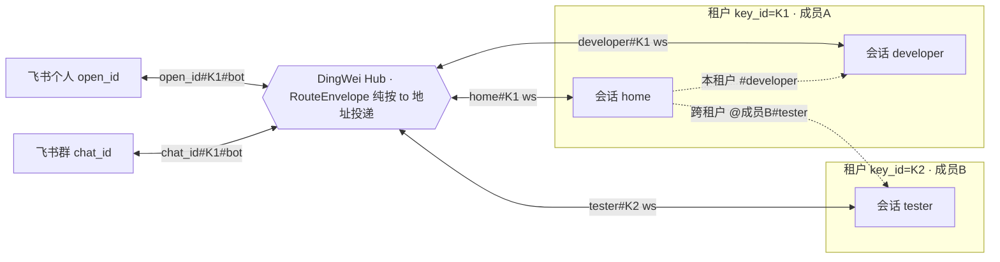
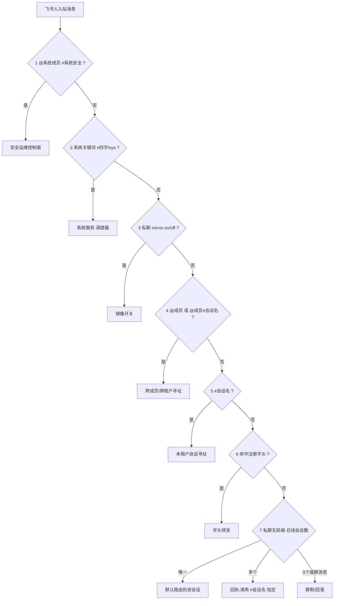
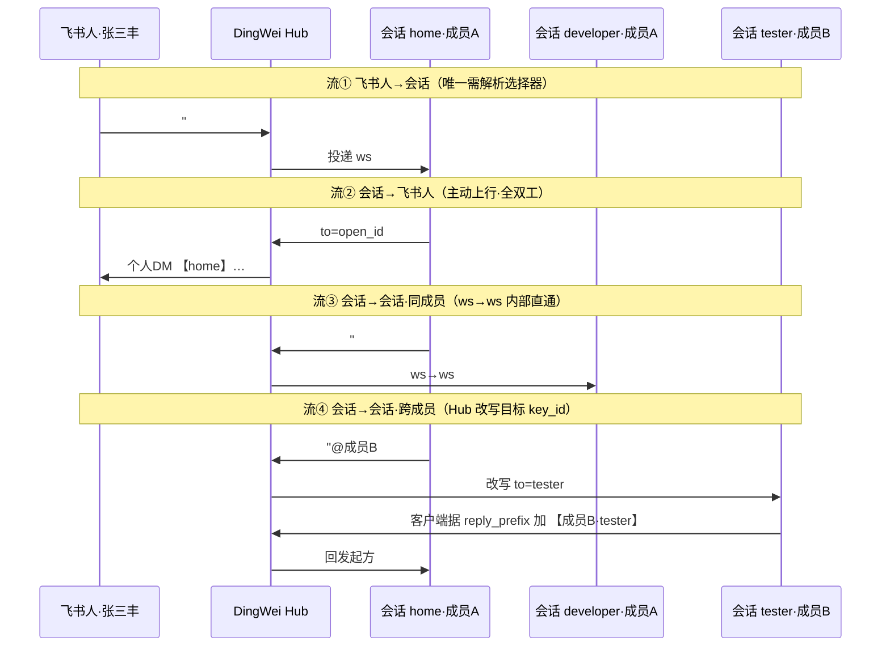

# DingWei · 飞书与 Agent 网络协同平台 · 产品规范

> 版本 v0.23 · 通用工程版(Go实现+脚手架; Docker交付; 全量不分期; 容量≤50人·≤5写每秒; 敏感不入git) · 面向「据此生成工程代码」编写
> **名字由来**：DingWei 取自北宋名臣**丁谓**「一策解三难、系统性整合、一举多得」的典故，正合本平台把消息总线/排期进度/AI 会话协同收拢进**一套统一寻址与路由**的内核；同时 **DingWei 谐音「定位」**——核心正是为团队成员与各 AI Agent **定位、寻址、路由消息**。
> **一句话定位**：一个**人 + Agent 网络混合的消息路由与协作中枢**——统一管理团队的**工作排期、进度提交、动态调整**并从对话中**佐证进度**；同时让接入的多个 AI CLI 会话（Codex / DeepSeek / Aider / OpenCode 等）构成一张 **Agent 网络：互相寻址、路由消息、协同工作**，人也可经飞书 @ 唤起任一 Agent、Agent 产出可镜像回飞书。
> **通用性约束**：本规范不绑定任何具体团队/人员/业务；所有成员、角色、任务、通道、数据源均为**配置项**，开箱即可适配任意团队。
>
> **v0.22 变更（R4–R19 现网收敛，以代码为准）**：本版将散落于 R4–R19 交办文档的设计**收敛进本单一权威规范**，并对齐现网实现——
> - 新增**「Agent 网络 · 会话间消息通信」章**（§4.7）：会话作为一等寻址实体（`session_endpoint`）、7 级入站分派、`#会话名`（本租户）/`@成员#会话名`（跨成员/跨租户）/私聊无前缀默认路由、四条消息流、镜像可控化、在线会话清单广播、`#系统安全`安全运维控制面。
> - 新增**「系统级调度器」章**（第 3.5 节）：系统服务 + 系统级路由（第三层寻址）、deepseek-CLI 调度器、自然关键词甲/乙类、多项目组版本化排期（`schedule_doc` 唯一真源）、聚合通知与调度分档、producer 生产者轨。
> - 扩 M0（webhook 入站等价通道）、M8（sessionHelper 客户端 + producer 轨）、§4.6 M9（候选池采集 + app_secret 加密 + 概念重组）、§5 数据模型、§9 部署硬化。
> - 历史变更（v0.20 M10 授权交互终端/会话镜像、v0.21 R14 多项目组）已并入相应章节。原 R* 交办/完成/测试文档为开发过程物，设计已并入本规范后归档退役。
>
> **v0.23 变更（项目负责人 + 两层周报审阅制，全平台通用能力）**：新增 §3.5.10——
> - **项目负责人（`project.owner_key`，必填）** 为每个项目的问责锚点（问题跟进 + 提交本项目完成情况）；**聚合项目**的 owner_key ＝ 聚合负责人（汇总审批发布）；**负责人 ≠ 产品经理**（`product_manager_key` 可选，产品侧角色、不担提交问责）；负责人不在报告正文露出。
> - **两层周报节奏**（对齐美洲下班 PDT 19:00）：非聚合项目周报 `0 2 * * 6`（UTC 周六 02:00 ＝ PDT 周五 19:00 ＝ 北京周六 10:00）、聚合项目周报 `0 2 * * 1`（UTC 周一 02:00 ＝ PDT 周日 19:00 ＝ 北京周一 10:00）。
> - 非聚合层：负责人**可选**逐项提交（不填按排期节奏展示），AI 据**全平台人-Agent 交互采集（M4 佐证）** 归纳补全；聚合层：**审阅制**（草稿 DM 聚合负责人 → 改稿/批准/否决 → 发布），发送确定性执行、AI 不擅自发正式群，承载会话设为隔离。
> - `project` 数据模型增 `owner_key` / `product_manager_key` 两列。

---

## 0. 背景与目标

### 0.1 痛点
- 排期分散在文档/口头，更新不及时、无留痕。
- 进度靠自报，**真实性难核**：报了"做完"却无证据；做了很多却没体现在排期上。
- 调整（顺延/改期）缺乏级联与冲突检测，靠人脑维护。
- 管理者要逐个询问才知道每人实际在做什么。

### 0.2 目标
1. 提供稳定可用的**排期 / 进度 / 调整**飞书产品（指令 + 交互卡片 + 自然语言）。
2. 提供**「AI 对话佐证进度」子系统**：从成员的 AI 助手会话记录中抽取工作事项，与自报进度对账，标出"已证实 / 滞后 / 无证据"。
3. 管理者在一处看到：团队甘特 + 进度看板 + 进度可信度对账。

### 0.3 通用化设计原则
- **零硬编码**：成员、角色、通道、任务、数据源路径、模型 provider 全部走配置（配置文件 / 数据库 / 环境变量）。
- **可插拔数据源**：AI 会话佐证的数据源以适配器形式接入，默认支持常见 AI CLI 的本地 transcript，可扩展。
- **可关停**：每个子系统（尤其 AI 佐证）可整体或按成员开关。

### 0.4 非目标
- 不做通用项目管理（任务依赖图、工时核算、绩效考核）。
- **默认**不留存/外发 AI 会话原文（M4 佐证仅抽取工作摘要）；**例外**：经显式授权（"必须使用" opt-in 门禁）的「授权交互终端 / 会话镜像」场景可放行原文双向传输，详见 §2.6 M10。此为默认关闭、逐项授权的能力，不违背"默认不外发"基线。
- 不替代飞书审批/日历（可后续打通）。

---

## 1. 用户角色与权限（角色为抽象类型，成员实例由配置定义）

| 角色类型 | 说明 | 权限 |
|---|---|---|
| 排期成员（member） | 拥有自己排期的执行者 | 增改**自己**排期、报进度/完成/风险、查询 |
| 协作角色（collaborator） | 如测试、产品等配合方 | 报进度/风险、查询；**不可改排期** |
| 管理者（manager） | 团队负责人 | 全局查看、汇总、对账报告、导出；不直接改他人排期（只读 + 提醒） |
| 系统（system） | 机器人本体 | 抽取、对账、渲染、提醒 |

权限基线：
- **身份门禁**：飞书 `open_id` → 成员映射（配置/数据库）；写操作只作用于本人那份。
- **角色门禁**：协作角色仅"上报"类指令；排期编辑类拒绝。
- 越权一律拒绝并提示。

---

## 2. 功能模块总览

```
DingWei
├── M0 消息总线      独立常驻服务 · 多机器人管道收发 · 按会话主体(个人/群)分收发队列(基础层)
├── M1 排期管理      新增/删除/改期/顺延 + diff+确认 + 冲突检测
├── M2 进度提交      进度/完成/结果 + 留痕(最新覆盖) + 任务匹配
├── M3 动态调整      顺延级联/批量改期/deadline 重算/提醒
├── M4 AI对话佐证    会话抽取→映射任务→进度对账(差异化核心)
├── M5 查询与门户    个人预览/团队总览/甘特/进度看板/对账报告
├── M6 风险管理      风险上报/归集/解除/周知
├── M7 通知提醒      日程提醒/deadline预警/对账异常/风险周知
├── M8 服务注册转发  外部服务注册 + 条件路由 + 转发(本机器人 = 可扩展消息路由平台)
├── M9 后台管理Web   运行监控/机器人配置/API key管理/字头列表(唯一性+覆盖检测)/最近100条消息
└── M10 授权交互终端  会话镜像(输出) + 从飞书回打指令(输入) 双向 · opt-in「必须使用」逐项授权门禁 · 挂 M0/M8
```

> 平台视角：M0 消息总线 + M8 服务注册转发 构成"通用飞书消息路由平台"；M1–M7 的工作管理是**内置注册服务**之一，其它业务服务注册即接入。M10 是承接"把飞书当会话交互终端"类需求的授权能力（默认关，授权即放行）。
>
> **两大 core 能力（本版收敛，见对应章）**：**§4.7 Agent 网络 · 会话间消息通信**——AI CLI 会话经 sessionHelper（§4.5.2）以一等寻址实体接入，`#会话名`/`@成员#会话名`/私聊默认路由互相寻址、ws→ws 路由、镜像回飞书、在线清单发现；**§3.5 系统级调度器**——系统服务 + 第三层寻址、deepseek-CLI 综合协调/定时佐证/分档通知、多项目组版本化排期、聚合与 producer 轨。

### M10 · 授权交互终端 / 会话镜像（authorized terminal · opt-in）详述

**定位**：把飞书当成成员本地会话（Codex 等 AI CLI，或任意可 tail 的会话）的**交互终端**，双向：
- **输出镜像**：会话 transcript 实时推送到飞书指定会话主体（个人/群）。
- **输入回打**：从飞书发来的消息回注到该会话（如同在终端里键入），走 §4.5 转发通道 / WS 长连接。

**与 M4 的区别（正交，可同源）**：M4「AI 对话佐证」＝抽取**工作摘要**对账、**不外发原文**；M10「授权交互终端」＝授权后的**原文双向终端**、外发原文。二者可共用同一本地 transcript 数据源（§0.3 可插拔），用途不同。

**门禁（opt-in，关键）**：
- **默认关闭**。仅对**显式声明"必须使用"并授权**的三元组 `(成员 × 会话源 × 目标会话主体)` 放行。
- 授权项入配置 / DB（M9 后台可管），字段含：源（transcript 路径 / 会话标识 / tmux 标签）、方向（镜像 / 回打 / 双向）、目标会话主体、机器人管道、是否含原文。
- 未授权源默认不镜像、不外发；越权拒绝并记审计。撤销授权即停。

**镜像启停控制（输出镜像的开关 · 2026-07-01 增补）**：
- **默认关**。输出镜像是**可显式启停**的能力，不常开。
- **飞书指令启停**：授权用户在**与机器人的单聊(DM)窗口**发控制指令启停某会话镜像（如 `mirror on <会话名>` / `mirror off <会话名>`）。**控制指令只经单聊受理，群里发起无效**（镜像开关是私密操作，不在公开群暴露/误触）。
- **也可 M9 后台配置**：每会话镜像开关 + 镜像目标（飞书地址）+ 方向，可查可改可撤。
- **镜像目标**：默认为**发起控制的飞书账号的单聊**；也可经 M9 指定到其它会话主体。
- 开关状态**持久化**（DB），重启保持；关闭即停止 transcript tail 与外推。

**实现**：挂 **M0**（双向收发队列、按会话主体分区、持久化/重试）+ **M8**（回打指令走 WS 长连接转发）。数据源以适配器接入（复用 §0.3：本地 transcript tail + 会话名/tmux 标签解析）。会话侧 sessionHelper 已具备 `mirror_loop`（tail transcript → 按会话名头推送），启停开关由上述控制驱动。

**承接现网**：现有 `aidev-session-mirror` / `codex-session-mirror` / `global-session-mirror`（原文输出镜像）+ `s1-forward`（飞书↔WS 双向）+ `session_input_fwd`（输入回打）等会话镜像/交互类机器人，迁移后统一为 M10 的授权项（见 `docs/feishu-bot/` 迁移映射）。

---

## 2.5 M0 · 消息总线与队列子系统（messaging backbone · 基础层）

定位：本工程是一个**独立常驻服务**。与飞书之间的所有收发都经过**消息总线**解耦——收到的消息先入「接收队列」，要发的消息先入「发送队列」，再异步处理 / 投递。

### 2.5.1 核心概念
- **会话主体（chat entity，即"人"）**：消息收发的对端，泛化为两类——**个人账号**（personal，飞书 open_id/user_id）与**群**（group，飞书 chat_id）。会话主体是**队列分区键**：**一个会话主体一套队列管理（含收 + 发）**。
- **机器人管道（bot channel）**：一个飞书机器人应用（独立 app_id/凭证）。**可有多个；每个都能收、也能发**。消息记录其经由的管道。
- **消息（message）**：统一内部结构，带 方向(in/out)、会话主体、机器人管道、内容、状态。

### 2.5.2 收消息（inbound）
```
任意机器人管道(webhook/长连接) 收到飞书消息
  ↓ 接入层: 验签 + 归一化为内部 Message(标注 来源管道)
  ↓ 身份解析(identity resolution):
      判定 chat_type: 个人单聊(p2p) / 群(group)
      ├─ 群   → 取 chat_id(事件自带) + 群名(事件不带→调 API 解析并缓存); chat_entity 不存在则登记
      └─ 个人 → 取发送者 open_id/user_id(事件自带) + 姓名(调 API 解析并缓存)
      会话主体(分区键) = 群(chat_id) 或 个人(open_id)
  ↓ 入「接收队列」(按 会话主体 分区, 持久化, 同主体保序)
  ↓ 接收消费者: 路由处理; 命中 M8 → 转发(payload 含完整身份, 见 §4.5)
```
> 注：飞书入站事件本身带 `chat_id / chat_type / 发送者 open_id`，**主要需解析的是"名称"**（群名、个人姓名）——按需调 API 取得并缓存（id 为权威，名字可刷新）。

### 2.5.3 发消息（outbound）
```
业务层产生发送请求(目标会话主体 + 内容 [+ 指定/默认 机器人管道])
  ↓ 入「发送队列」(按 会话主体 分区, 持久化)
  ↓ 发送消费者: 按主体取出 → 选定机器人管道 → 调飞书发送 API
  ↓ ack/失败重试/死信; 记录结果; 按主体限速
```

### 2.5.4 队列设计
- **分区**：每个会话主体一对队列(in/out)，**同主体内 FIFO 保序**，主体间隔离、互不阻塞。
- **持久化**：队列落盘，服务重启不丢；消费 at-least-once + 幂等（用飞书 msg_id 去重）。
- **重试/死信**：发送失败指数退避重试，超阈值进死信并告警。
- **限速**：按"会话主体"+ 按"机器人管道"两级限速（适配飞书频控）。
- **后端可插拔**：**本规模（≤5 写/秒）用 SQLite 表队列即可**（message 表 + 状态机），无需引入 Redis；Redis Stream 仅在规模数量级增长时可选。抽象为 `Queue` 接口（见 §13.2）。

### 2.5.5 多机器人管道
- **管道注册表**：配置多个机器人（凭证、可达范围、用途如"个人提醒"/"群周知"）。
- **收**：任一管道收到的消息都归一化入队，记录来源管道。
- **发**：发送请求可**指定管道**，或由路由规则按（主体类型/用途）选默认管道；默认"回信走来时同一管道"。
- 凭证隔离；某管道故障不影响其它管道收发。

### 2.5.6 与上层关系
- 路由层/业务层只与**队列**打交道（消费 inbound、产出 outbound），不直接调用飞书 API → 收发与处理彻底解耦，便于削峰、重试、灰度、可观测。

### 2.5.7 消息留存与按月归档（全部入 SQLite）
- **全部入 SQLite**：**飞书机器人收发的消息**（收 + 发，含完整内容）与全部配置一律存 **SQLite 主库**（不再用按天 jsonl 日文件）。⚠️ 与 AI 佐证区分：**AI 助手 transcript 仅抽工作摘要、不留原文**（§0.4 / §12.4）；机器人消息留存可**按群关闭 / 脱敏**（可配）。
- **热保留窗**：主库保留近期热数据（窗口可配，默认按月），供实时查询 / 对账。
- **按月归档（替代旧"按天→月度 gz"方案）**：调度层（cron）按月将**超出热保留窗**的消息**滚动导出为当月归档库** `archive/messages-YYYY-MM.sqlite`（可 `.gz` 压缩），导出后从主库删除，主库保持精简。
- **查询**：近期查主库；历史查对应月份归档库（按需挂载 / 解压）。
- **配置项**：热保留窗、归档周期（默认按月）、是否压缩、是否归档群、过期清理策略——均存于 SQLite 配置，经 M9 调整。

### 2.5.8 webhook 入站（事件订阅 · R19，与长连接等价）
在长连接（WebSocket）入站之外，提供飞书**事件订阅 webhook** 作为等价入站通道，两条通道最终归一化为同一 `Message`、复用同一 `chat_entity`/候选池采集/入站队列路径，对下游透明。
- **端点**：`POST /webhook/{channel}`，末段 `{channel}` 按 `bot_channel` 的 `id`/`name` 大小写不敏感匹配选管道；命中已禁用/禁收管道则拒收；完全未匹配退回旧行为（path 作管道名明文直收 + 安全告警）。对外经 nginx `/dingwei/` 反代到后端（WS 走 `/dingwei/ws/`），带 `X-Real-IP`/`X-Forwarded-For` 供采集真实客户端 IP。
- **每管道独立安全**（`bot_channel.verification_token`/`encrypt_key`，仅 webhook 需要）：均未配=明文直收（每管道只告警一次）；配 `verification_token`=校验载荷 token 不符拒收；配 `encrypt_key`=先解密飞书 encrypted 载荷再校验解析。
- **事件处理**：`challenge` 直接回；支持飞书 2.0 `im.message.receive_v1`，归一化入接收队列；兼容旧本地冒烟 fake JSON 桩。后台 `/admin/bot-channels` 可填 token/encrypt_key（只显示已设置/未设置）。

---

## 3. 功能需求详述

### M1 排期管理
- 指令（每行一条）：
  | 操作 | 语法 | 示例 |
  |---|---|---|
  | 新增 | `+ MM/DD-MM/DD 任务` | `+ 07/20-07/22 编写方案文档` |
  | 删除 | `- 关键词` | `- 旧任务关键词` |
  | 改期 | `改 关键词 MM/DD-MM/DD` | `改 训练 07/05-07/07` |
  | 顺延 | `顺延 MM/DD +N天` | `顺延 07/20 +3天`（该日起的条目整体后移） |
  | 全量替换 | `全量` + 多行排期 | 一次替换本人整份 |
- **两步式写**：解析 → 回 **diff 预览**（🆕/❌/✏️/⏩）→ 回 `确认`/`取消` 生效。
- **冲突检测**：同人时间段重叠、共享资源（可配置的资源池，如设备/环境）冲突 → 预览时提示。
- 生效后即时刷新门户（DB 动态渲染，缓存失效即刷）+ 可选周知群。
- **排期数据组织（R14 · 多项目组）**：支持**多个项目组**，每组含 **团队日程 + 各成员个人日程 + 独立通知群**。**SQLite 为唯一真源、版本化存储**（`schedule_doc` 表按 `项目×kind(team|personal)×成员×version`，每次改追加一版、取最新版；多版本即历史/回滚，取代备份目录）——**无长期 md 文件、不配文件路径**。成员↔项目由会话采集（姓名 + 所在群 chat_id）建花名册。个人日程可 **NL 直设** 或 **后台整贴**；团队日程可 **群关键词上行** 或 **后台整贴**（整贴走确定性校验 + 预览确认 + 版本兜底）。门户由 **DingWei 从 DB 动态渲染 + 10min 缓存**呈现（详见 M9/§门户）。

### M2 进度提交
- 指令：
  | 操作 | 语法 | 示例 |
  |---|---|---|
  | 报进度 | `进度 <任务关键词> <结果/偏差/调整>` | `进度 训练 基线跑通，约60%` |
  | 标记完成 | `完成 <任务关键词>` | `完成 数据清洗` |
  | 结果 | `结果 <任务关键词> <内容>` | 同进度，语义别名 |
- 匹配：关键词 → 本人排期条目（精确含 → 语义兜底）；匹配不到则按关键词独立留痕并提示。
- 存储：append 留痕，**同任务最新覆盖**展示、历史保留。
- 进度可带百分比/状态/偏差/所需调整（如"顺延3天"可联动 M3 提示）。

### M3 动态调整
- 顺延：锚点日期起的条目**级联后移** N 天，重算 deadline。
- 批量改期 / 整体平移。
- 调整后：冲突再检测 + 通知受影响方 + 门户刷新 + 留痕（谁、何时、为何调整）。
- **变更联动（自动级联）**：任何**排期 / 进度的提交或修改**自动触发——① 更新该成员**个人排期（写 `schedule_doc` 新版本）** → ② **协调更新所在项目的团队日程**（冲突 / 共享资源 / 依赖再检测、deadline 重算；LLM 重写受 `<!-- WP:KEEP -->` 保护块保护 + 写后断言）→ ③ 门户从 DB 动态渲染（10min 缓存、写入即失效），无需导出文件。
- **影响通知**：当变更产生**明显影响**（关键节点顺延、跨人资源冲突、deadline 改变、依赖被打断等）→ **向所有当事人（受影响成员 + 管理者）发消息通知**（经 M7）。

### M4 AI 对话佐证进度（差异化核心）
目的：用"成员实际与 AI 助手做了什么"客观佐证自报进度。详见 **§6**。
- 输入：成员的 AI 助手会话记录（transcript），来源可配置。
- 流程：抽取工作事项 → 映射到排期任务 → 与自报进度对账 → 生成佐证与可信度标记。
- 输出：
  - 每人「工作内容佐证」：本周从对话中识别到的实际事项（产出/文件/提交/决策）。
  - 进度对账状态：✅已证实 / 🟡部分证实 / ⚪无证据 / 🔴疑似滞后（报完成但无对应证据）/ 🟢超前（有证据但未报）。
- 边界：只抽**工作相关**摘要；原文不外发；成员可按需关闭个人佐证（隐私开关）。

### M5 查询与门户
- 自然语言查询（路由到 LLM）：如「我的排期」「本周谁在做什么」「某任务进度到哪」。
- 门户（静态站点，可配置发布路径）：
  - 团队总览 + 统一甘特 + 合并周历 + 冲突。
  - **进度看板**：各任务状态/百分比/最近进度。
  - **对账报告**：自报 vs AI 证据，可信度一览（仅管理者可见明细）。
- 飞书内查询返回**纯文本**（飞书聊天不渲染 markdown 表格/框）；门户用 HTML 表格。

### M6 风险管理
- `风险 <内容>`：记录 + 相同风险归集 + 周知群。
- `风险解除 <关键词>`：解除 + 周知。
- 风险关联任务/责任人，门户单列。

### M7 通知提醒
- 日程提醒（每日个人当天/次日任务）。
- deadline 预警（临近未完成）。
- 对账异常提醒（🔴疑似滞后 / ⚪长期无证据）给本人 + 管理者。
- 风险周知。
- **变更影响通知**：排期/进度变更产生明显影响时，向**所有当事人**（受影响成员 + 管理者）发通知（§M3）。
- 通道：**单聊/群聊通道可配置为不同飞书应用**（便于隔离个人提醒与群周知）。

---

## 3.5 系统级调度器（system scheduler · R8/R9/R14/R16 收敛）

> 与 M1–M7 平级的系统能力：一个**系统级、常驻**的调度器，自动做排期综合协调、定时佐证对账、群/个人分档通知，并把排期建模为**多项目组 + SQLite 版本化唯一真源**。

### 3.5.1 系统服务与系统级路由（第三层寻址）
在两层寻址（系统默认内置能力 + 租户级 `key_id → 会话名/字头`）之上新增**系统级服务**层：
- **系统服务（system service）**：不隶属任何租户 `key_id`，全局唯一；调度器是首个系统服务，以系统级凭证鉴权接入。
- **系统级路由关键词**：保留的全局关键词命中即路由到对应系统服务，与租户 `#会话名` 分属**不同命名空间、不冲突**。
- 数据模型：`system_service(name, description, delivery, endpoint, active)` + `system_route(keyword, service_name, action, priority, active)`。

### 3.5.2 调度器形态
系统级常驻 **deepseek-CLI**（复用 Anthropic 兼容配置：`ANTHROPIC_BASE_URL=…deepseek.com/anthropic` + deepseek 模型），具文件/DB 读写能力；进程内 `Runner`/`CLIRunner`，经 `bash -lc` 调起、prompt 走 stdin、默认超时 3 分钟。敏感密钥只走 env/系统配置，不入库、不入 git。

### 3.5.3 综合协调（Coordinate / CoordinateProject）
排期修改类请求触发：读团队总排期 + 相关个人排期 + 本次变更 →（**KEEP 保护块掩码**：`<!-- WP:KEEP:N -->…<!-- /WP:KEEP -->` 人工策展块抠成占位符不喂 LLM）→ LLM 综合协调（检测冲突/依赖/顺延/资源占用）→ **缝回保护块 + 写后断言** → 落新版本。
- **协调 prompt 硬约束**：保持原 Markdown 结构/标题层级/列表风格，只改必要处；未受影响段落逐字保留；`WP:KEEP:N` 占位原样保留；**禁止新增时间戳/生成时间/额外标题/解释文字/多余空行**；只输出正文。
- **写后校验 `validateTeamDoc`**（协调与整贴共用）：非空 + 最小长度（≥20 字符）+ 合法 UTF-8 + ``` 围栏成对 + mermaid 块数不少于上版 + KEEP 块数不少于上版；任一不过则拒写、保留原版。

### 3.5.4 定时佐证（RunEvidence / RunEvidenceProject）
按 cron 执行：读 ①日程计划（团队总 + 个人排期）②按成员组织的 AI 会话内容（消息 + 可配 transcript），印证——计划项有对话佐证=已执行、无=无证据/未执行、会话里做了但不在计划=计划外。产出**按成员组织**的纯文本佐证报告（已执行/无证据/计划外），完整报告落盘/落库。

### 3.5.5 群/个人分档通知（R16 调度分档 · 抓主线）
佐证后经出站机器人发通知，**一律抓主线、不过细**、纯文本禁 markdown/表格：
- **群通知**：每天 1 次（UTC 0:00，`notify.group_cron` 默认 `0 0`），≤10 行摘要=关键日程变更（无则「无」）+ 进度概览（已执行 N/无证据 M/计划外 K）+ 一句主线点睛 + 「完整佐证报告见 <路径>」（完整报告只落盘、不整篇发群，避免刷屏）。
- **个人提醒 DM**：每天 2 次（UTC 0:00/6:00，`notify.personal_cron` 默认 `0 0,6`），发各成员飞书个人=其 personal 排期最新版摘要 + 待办提醒。
- 通知目标（`schedule.notify_chat`/`notify_bot`）为**运行配置预置项**，后台可改即时生效，env 仅作 bootstrap 默认。默认时区 UTC，cron 均可配；佐证默认 `0 0,6 * * *`。

### 3.5.6 自然语言排期关键词（R9）
排期类消息用 **`#` + 4 个汉字** 自然关键词标记，路由到调度器（不需 `key_id`）。**按关键词本身固定分两类**（不靠正文语义判断）：
- **甲类 · 进度上报 → 只记录、不唤醒 LLM**（`action=record`）：如 `#进度汇报 #日程上报 #工作提交`；仅记为该成员进度上报（存 `progress`），回执「已记录」；供看板展示与定时佐证读取印证，**上报本身不触发 deepseek**。
- **乙类 · 排期修改 → 主动唤醒 LLM 判意图并执行**（`action=coordinate`）：如 `#修改日程 #调整日程 #工作调整`；唤醒 Coordinate（协调→写新版+新版本），回执结果。
- **头部约束**：关键词须在消息头部（`#四字 <正文>`）；**唯一例外是前导 @提及**（先剥离含对本机器人的字面 @，再要求剩余以 `#四字` 开头）；夹在正文中间的 `#xxx` 不触发。关键词后台可增删/改路径；`sys:调度` 保留为隐藏兼容别名。

### 3.5.7 多项目组排期（R14 · SQLite 版本化唯一真源）
**核心定调**：日程内容（团队 + 个人）以 **SQLite 为唯一真源、版本化存储**；Markdown 降级为门户渲染的导出产物。
- **数据模型**：`project(id, name, notify_chat_id, notify_bot_id, transcript_dirs, evidence_cron, evidence_tz, parent_id, active, owner_key, product_manager_key)`（无 md 路径/备份目录，`parent_id` 支持层级，默认 `proj:default`；`owner_key`＝项目负责人必填、`product_manager_key`＝产品经理可选，详见 §3.5.10）；`schedule_doc(id, project_id, kind[team|personal], owner_key, version, content, source[coordinate|paste|nl|import], created_by, created_at)`（**每改追加一版、取最新即用**，全版本留存替代备份，支持回滚/审计，按下限 prune）；`project_member(project_id, owner_key)`（个人 doc 按全局唯一 owner_key 单份、多项目共享引用）；`seen_person_group(open_id, bot_channel_id, group_chat_id, group_name, last_seen_at)`（采集「姓名+所在群」驱动后台按群分配成员）。
- **项目化调度**：`resolveProject(source)` 由来源群 `chat_id` 匹配 `project.notify_chat_id`、未命中回退 `proj:default`；快照从 DB 取该项目最新 team doc + 各成员最新 personal doc；`CoordinateProject`/`NotifyProject`/`RunEvidenceProject` 按项目各跑各发；个人直设（NL 加/改/顺延）取 personal 最新版→应用→追加新版本，NL 与整贴合一均落 `schedule_doc`。
- **门户**：`/schedule/` 改为从 DB 动态渲染（复用 build_site 样式），**内存缓存 10min TTL、任一 schedule_doc 写入即失效该项目缓存**；多项目走 `/schedule/<project>/` 或选择器；去除长期 md 真源与路径配置。
- **后台整贴**：跳过 LLM 重写但不裸入库——过 `validateTeamDoc` 硬校验 + 预览 diff + 显式确认才 append；错版只增一版、一键回滚。

### 3.5.8 通知层级与聚合（R16）
按通用层级建模（部门→项目→聚合），不做业务专用硬编码：
- **通知继承**：解析 `notify_chat` 时——①项目有自己的群→发自己群；②没有→上溯父级（部门）群；③再没有→全局默认。建了自己的群自动切走。
- **通用聚合（可配 + 可嵌套）**：`project_aggregate_source(aggregate_project_id, source_project_id)` 多对多，来源后台勾选、可增删；聚合项目可作更上层聚合来源（嵌套 + 循环检测）；一个项目可进多个聚合。聚合型 project 遍历已配来源各取「最新 team 摘要」拼一条汇总，**每周 2 次自动组装直发**（后台整贴仍走确认）；per-project `evidence_cron` 可覆盖（如聚合项目用 `0 2 * * 1,3`）。

### 3.5.9 生产者轨（架构约束）
一切生产者 = 机器人管道（bot_channel）或 sessionHelper，不做外部 API/独立 cron 脚本。CC-Connector 接为双向 bot_channel（inbound 日历/日程修改归一化到 `#修改日程` 复用协调）；代码分析/系统告警/会话镜像由 sessionHelper（producer 模式）承载；**普通 sessionHelper 不向群发消息，配 `SH_TARGET_GROUP` 的特殊会话才向指定群发**，经 DingWei → bot_channel 出站。详见 §4.7 / M8 producer 轨。

### 3.5.10 项目负责人 + 两层周报审阅制（全平台通用能力）

> 本节把「谁对项目负责、周报怎么出、谁审批」定为**平台通用规则**；任何团队都可配置自己的项目/负责人/聚合项目/通知群，**零代码 onboard**。研发一组（`proj:ai-research`）为首个落地样板，后续推广到其它项目团队。

**项目负责人（project owner）——必填的问责锚点**
- **每个项目有且仅有一个负责人**（一名成员，**必填、不能空**）。职责：① 该项目的**问题跟进处理** ②**提交本项目完成情况**（周报数据源头）。**没有负责人 = 问题无人跟进**，故强制。
- **聚合项目**额外有一个**聚合负责人**，负责把各来源项目的说明**汇总成周报 → 审阅/批准/发布**。
- **负责人 ≠ 产品经理**：产品经理（可选）是**项目中某个子项目的负责**（如产品侧的体验/评估/需求，如陈燕/李远洋），**不是总项目的责任人，因此不在问责范围**——不承担项目级的问题跟进与「完成情况提交」。问责只落在**项目负责人**身上。
- 负责人是**内部问责关系，不在报告正文露出**。
- 数据模型：`project` 增 `owner_key`（负责人，必填）、`product_manager_key`（产品经理，可选）；聚合负责人 = 聚合 project 自己的 `owner_key`。

**两层周报节奏——全平台通用，时间对齐美洲下班（PDT 19:00）**

| 层 | 触发 cron（UTC） | = PDT | = 北京 | 内容 |
|---|---|---|---|---|
| **非聚合项目周报** | `0 2 * * 6`（周六 02:00） | 周五 19:00 | 周六 10:00 | 各项目各自出周报 |
| **聚合项目周报** | `0 2 * * 1`（周一 02:00） | 周日 19:00 | 周一 10:00 | 汇总 + 审批 + 发布 |

- **非聚合项目周报（周六 02:00 UTC）**，含两条轨：
  - **周内提交轨（周一~周五 · 只记录不播报）**：项目负责人**随时逐项提交「完成事物项」**，**复用 M2 进度提交**（甲类 `#进度汇报`/`#工作提交` → `action=record`，只存 `progress`、**不唤起 LLM**）；系统累积、不即时播报。提交**非必填**——不提交则周报按项目排期计划节奏展示。
  - **周六归纳时 · AI 必须区分两类数据源**：① **完成事物提交项**（本周 `progress` 里负责人显式提交的 done 项，作**权威主干**——"做了什么"以此为准）；② **人-Agent 交互工作内容**（全平台 `SH_COLLECT` 采集 / §6 M4 佐证，作**印证与补全**，或负责人未提交时兜底展示）。AI **以①为主干、②为佐证补全**，产出各项目周报，不得把交互内容当作已完成事项。
- **聚合项目周报（周一 02:00 UTC）**：聚合负责人把各来源项目周报**汇总 → 审阅/批准/否决 → 发布**到通知群。**必须经聚合负责人批准才发**（审阅制，见下）。

**聚合周报审阅制（human-in-the-loop，发正式群前必须过负责人这关）**
- 发布前的窗口内，系统生成聚合周报**草稿**并 **DM 聚合负责人**审阅（附操作提示：如何改稿/批准/否决）；
- 负责人交互（经专职会话或 M9 后台）：**改稿**→ 更新定稿；**批准发送**→ 立即发；**不要发送**→ 否决、即使到点也不发；三者皆无 → 到点（周一 02:00 UTC）按定稿发；
- **发送确定性执行**（脚本认「批准/否决」标记），**AI 只改稿 + 记录批准否决，绝不擅自发正式群**（正式通知渠道不可撤回，见 §4.7 相关约束）；
- 承载审阅交互的会话应设为**隔离会话**（`no_directory`，不进在线清单、不可被别的 Agent 派活）。

**通用化落地**：onboard 新团队 = 在 M9 后台建其项目、指定各项目负责人（+可选产品经理）、配聚合项目与通知群、接各负责人的 sessionHelper 采集 → 两层周报节奏自动生效，无需改代码。

---

## 4. 交互设计

### 4.1 三级路由（显式指令 → 符号唤起 LLM → 静默）
```
收到消息(来自接收队列)
  ↓ 身份解析(open_id → 成员/角色; 会话主体)
  ① 显式结构化指令匹配(+ - 改 顺延 进度 完成 结果 风险 确认 取消 全量 帮助 认领)
       命中 → 指令引擎(M1/M2/M3/M6) → diff/留痕/回执      [确定性, 不唤起 LLM]
  ② 未命中 → 检测「唤起符号」(可配置: @机器人 / 前缀符 / 话题标记)
       含符号 → 唤起 LLM 意图判定 {是否管理类? category? 参数}
                ├─ 管理类 → LLM 抽参 → 对应模块(排期/进度/调整/风险/查询; 必要时 diff+确认)
                └─ 非管理类 → 问答 / 兜底 / 忽略
  ③ 无符号 → 不唤起 LLM(群内默认静默; 单聊可配置默认走问答)
```

### 4.2 交互卡片（升级项，P2）
- diff 预览用飞书**交互卡片**（确认/取消按钮）替代纯文字回「确认」。
- 进度看板/对账用卡片或门户链接。

### 4.3 帮助
- `帮助`/`格式`/`?` → 返回指令速查（纯文本）。

### 4.4 特殊符号唤起 LLM 路由（symbol-triggered routing）
动机：并非每条消息都是管理指令（群里尤甚），逐条 LLM 分析成本高、易误路由。用**可配置的特殊符号**作为"唤起开关"——命中符号才唤起 LLM 做意图判定与路由，既省成本又防误触。

- **唤起符号（可配置集合，示例）**：
  - `@机器人`（群内点名）
  - 前缀符号（如 `/`、`#`、`!`、`：` 等约定符）
  - 话题标记 / 自定义标记（如 `#排期` `#进度`，或约定的 emoji/符号）
- **判定与路由**（承接 §4.1 第②级）：
  - 含唤起符号且非结构化指令 → **唤起 LLM 意图分析**，输出结构化判定：
    ```
    { is_management: bool,
      category: schedule | progress | adjust | risk | query | none,
      owner, params{task, dates, action, percent...}, confidence }
    ```
  - `is_management=true` → 按 category 交对应模块；写类动作仍走 diff+确认。
  - `is_management=false` → 普通问答 / 兜底 / 忽略。
  - 低置信度 → 回澄清问句或转人工，不擅自写库。
- **优先级**：显式结构化指令（§4.1①）永远优先、零成本、确定性；符号唤起 LLM 只在未命中指令时触发；无符号不唤起。
- **可配置**：符号集合、各符号 → 行为映射、群/单聊是否分别启用、置信度阈值、是否需二次确认。
- **联动（可选）**：被判为管理类的消息可联动写排期/进度；同一套符号也可用于在 §6 AI 会话佐证中**标记**需重点抽取的片段。

### 4.5 服务注册与消息转发（M8 · service registry & dispatch）
定位：本机器人服务同时是一个**消息路由平台**——其它服务可向它**注册**，注册时声明**路由条件**；凡符合条件的消息被**转发到对应服务程序**处理。内置的"工作排期/进度管理(M1–M7)"本身就是一个注册服务。

- **注册信息（registered service）**：
  - `service_id / name / 描述`
  - **路由条件（routing rules，可组合 AND/OR、带优先级）**：
    | 条件类型 | 示例 |
    |---|---|
    | 唤起符号 / 前缀 | `/`、`#task`、`@某机器人` |
    | 关键词 / 正则 | 含"报销"、自定义正则 |
    | 会话主体 | 指定个人/群，或类型(personal/group) |
    | 指定飞书账号 | 仅对某些飞书账号(个人/群)生效；须 ⊆ 该注册方 API key 绑定的账号集合 |
    | 机器人管道 | 来自某 bot channel |
    | 指令 | 首词命中某指令集 |
    | LLM 意图类别 | category = 某域（承接 §4.4 的意图判定） |
  - **转发方式（delivery）**：**WebSocket 长连接（字头路由必须用此）** / HTTP 回调(webhook URL) / 本地进程(exec stdin·stdout) / 转发到队列(topic) / 进程内插件(entrypoint)
  - **转发 payload（归一化消息，送达注册方时身份信息一并包含）**：
    ```
    { msg_id, bot_channel, ts,
      chat_type: personal | group,
      chat:   { chat_id, name },              // 群: chat_id + 群名; 个人单聊: p2p chat_id
      sender: { open_id, user_id, name },     // 发送者(群消息=发言人; 个人=本人)
      content:{ type, text, raw },
      matched_prefix, stripped_text? }
    ```
    - 注册方拿到的不只是文本，还有 **chat_type / 群 id+群名 / 个人 id+姓名 / 发送者**，可据此自行处理与回发。
    - 缺失的群名/姓名由本服务解析后填充并缓存（见 §2.5.2）；id 为权威、名字可刷新。
  - **注册方发送目标（回发 / 主动发）可按 id 或 名称指定**：
    - 按 **id**：`{ id: <chat_id|open_id>, type? }` — 直接定位。
    - 按 **名称**：`{ name: <群名|姓名>, type?: personal|group }`：
      - 名称在记录中**全局唯一**（跨个人+群仅一条）→ **无须指定 type**；
      - 个人/群存在同名 → **须指定 type** 消歧；
      - 指定 type 后仍重名 → 报错并返回候选 id 列表，由其选择（不擅自猜）。
    - 解析依据 = 本服务为每个主体记录的 `chat_entity(机器人渠道 + id + 名称 + 类型)`；命中后**以 id 发送**（id 权威），名称仅作便捷入口；经哪个渠道发默认用记录该实体的渠道或注册方指定。
  - **回复处理（reply_mode）**：`sync`(同步返回内容→经发送队列回发) / `async`(服务稍后调回发 API) / `none`(只投递不回)
  - **凭证/鉴权**：转发签名/token；服务异步回发也需鉴权
  - `enabled / 优先级 / 超时 / 重试`
- **分发流程**：
```
inbound 消息(身份/会话主体已解析, 经 §4.1 三级路由)
  ↓ 按优先级遍历已注册服务的路由条件(可调用 §4.4 LLM 意图判定)
  ├─ 命中(first-match 或 fan-out, 可配置)
  │    → 按 delivery 转发归一化消息(含 会话主体/管道/身份/内容)
  │    → 收服务响应(sync) → 入发送队列 → 回发(原管道或指定管道)
  └─ 未命中任何服务 → 默认服务(内置问答/兜底)
```
- **示例（前缀字头路由）**：某程序在机器人服务上注册字头 `openapi`（`match_type=prefix, match_expr="openapi"`）→ **所有以 `openapi` 开头的消息整条转发到该程序**；其响应经发送队列回发给原会话主体。同理可注册 `报销`、`审批`、`#task` 等不同字头/符号，各自路由到不同服务，互不干扰。
- **字头匹配语法（通配符 + 多字头列表）**：
  - **通配符**：`?` = 一个**可选**字符（0 或 1 个）；`*` = 任意多个字符（含 0 个）。
  - **多字头列表**：用 `；` 或 `;` 分隔多个字头，**任一命中即转发**（OR 语义）。
  - **示例**：注册 `openAPI???；codex` → 匹配「以 `openAPI` 开头、其后再带 **0~3 个任意字符**」**或**「以 `codex` 开头」的消息，均转发到该注册方。
  - 可配置：是否大小写敏感、是否剥离命中的字头再转发、是否要求字头独占整行还是仅作前缀。
- **字头唯一性与通配符覆盖检测（注册/修改时强校验）**：
  - **唯一性**：同一作用域（账号范围 × 渠道）内，字头**不可重复注册**。
  - **覆盖/冲突检测**：两条字头模式若可能被**同一输入同时命中**即判重叠，例：`openAPI???` 与 `openAPI1`、`open*` 与 `openAPI`、`*`（吞并一切）。处理策略（可配）：默认**拒绝重叠注册**；或允许但**按优先级裁决**（更具体/更长字头优先，或显式 priority），并在后台 M9 **高亮冲突待确认**。
  - 实现：注册/修改前由服务做 **pattern 相交检测**（**确定性算法**，见 §15.1；非样例探测）；`*` 级宽通配需额外警示。
- **注册鉴权与飞书账号绑定（API key）**：
  - 注册方程序须持有**本机器人服务签发的 API key**；建立 WS 长连接、注册/更新路由、接收转发时均以此鉴权（WS 握手校验，失败拒连）。
  - **每个 API key 绑定一个或多个飞书账号**（个人账号 / 群）= 该注册方被授权服务的账号集合。
  - **账号范围受限（⊆ 绑定集合）**：注册路由时若指定飞书账号，**必须是该 API key 绑定账号的子集**，越权拒绝；不指定则默认 = 该 key 绑定的全部账号。
  - **转发判定追加账号校验**：消息匹配字头 **且** 其所属飞书账号 ∈ 该路由账号范围 → 才转发到该注册方；否则不命中（防止越权接收他账号消息）。
  - API key 由管理侧**签发 / 吊销 / 改绑**；泄露可即时吊销；不同注册方 key 相互隔离。
- **字头路由必须走 WebSocket 长连接**：注册字头路由的程序，**必须与机器人服务建立 WebSocket 长连接**并保持在线；机器人收到匹配字头的消息时，**通过该 WS 实时转发**。
- **WS 字头转发语义（至多一次 · 断连即失败 · 不补发）**：
  - 转发瞬间该字头程序 WS **在线** → 经该 WS 实时推送转发。
  - 转发瞬间 WS **已断开** → **不入转发队列、不重试、不补发**：
    1. 该消息**仅本地保存**（留存/审计用，不进待转发队列）；
    2. **回应原消息发送方**：`该消息投递失败` + 原消息内容（原样附回，便于其自行重发）；
    3. **即使长连接随后恢复，也不转发该条**（无 replay / 无 store-and-forward）。
  - 即字头 WS 转发是**至多一次（at-most-once）**语义，刻意不做"离线缓冲后补投"，避免投递过期/乱序内容。
  - 边界：此"不重投/不补发"**仅作用于 字头→WS 这一跳**；机器人自身的接收/发送队列(M0)仍照常持久化（含那条"投递失败"回执的发送、本地留存）。
- **服务生命周期**：注册 / 注销 / 更新 / 列表 / 健康检查(WS 心跳)；服务不健康/断连按上述语义处理并可告警。
  - 注：M0 队列的"重试 + 死信"适用于 HTTP/进程/队列 等其它转发方式；**字头 WS 转发明确不适用重试/死信**（见上）。
- **注册方式**：管理 API(HTTP) 或配置文件；鉴权后写入服务注册表。
- **内置即插件**：工作管理(M1–M7)登记为内置服务；新业务（报销、审批、问答、其它机器人）**注册即接入，无需改核心**。
- **隔离与安全**：每服务独立凭证与路由域；只收到匹配它的消息（最小可见）；转发内容可按服务配置脱敏。

### 4.5.1 统一寻址协议（To/From 信封 · address envelope）

M8 路由的地址模型：每个端点（飞书用户 / AI 会话）都有**唯一地址**，消息带 **结构化信封**（`to`/`from` 与正文分离）。

**两类地址（`#` 分隔；底层用 id，显示名仅展示）**
| 端点 | 地址格式（canonical） | 例 |
|---|---|---|
| 飞书用户 | `<open_id>#<api_key>#<bot_name>` | `<admin-open-id>#FB-test-key-0000#UnifiedRobot` |
| 会话用户 | `<会话名>#<api_key>` | `home#FB-test-key-0000` |
> `飞书账号名`（如"张三丰"）仅作展示放在信封 meta，唯一键用 `open_id`。

**API-key = 人/租户命名空间**
- 全系统唯一；**可绑定多个飞书账号（open_id）**；**拥有多个会话**。
- **会话名在同一 api_key 下唯一**（跨 key 可重名）。→ 一个人可挂多个 ws 客户端＝多个不同会话名。

**🔑 地址 key-id 与连接 secret 分离（安全 · 必须）**
> 地址里出现的 `#<api_key>` 是**公开的租户标识 key-id**，**不是**连接鉴权密钥。二者必须分离：
- **地址 key-id（公开）**：进地址 / To-From / 日志，可见即可、非密。格式 `FB-<账号简写>-<YYYYMMDD>-<随机>`（可读，一眼识人）；若需隐藏账号名/防枚举，改用 `hex(sha256(账号+日期+随机))[:32]` 做不可读 ID。全系统唯一。
- **连接 secret（私密）**：session/client 连 `/ws/session/{会话名}` 时提交的鉴权密钥；随机生成（如 `wp_`+64hex）；**只存 sha256 hash 入库，绝不进地址/日志**。
- **绑定关系**：`key-id(公开) ↔ secret_hash(私密) ↔ 多个飞书 open_id`。路由用 key-id，鉴权校验 secret。
- ⚠️ **禁止把连接 secret 当作地址 key**——否则"地址泄露＝密钥泄露"。前文各地址示例中的 `FB-test-key-0000` 即 key-id（公开），非 secret。

**飞书目标：个人 DM / 群 + @提及（地址表达"发到哪"，meta 表达"@谁"）**
飞书地址 `<target>#<key_id>#<bot_name>` 的 `<target>` 按前缀区分个人/群：
- `ou_…`（open_id）→ 发**个人 DM**。
- `oc_…`（chat_id）→ 发**群**。
- **@提及不进地址、进信封 meta**：`meta.at = ["<open_id>", …]`；出站发群时若 `meta.at` 非空 → 渲染飞书 `<at user_id="ou_…"></at>` 进正文，群里即 @到人（发个人 DM 时忽略 at）。
- **入站信封带原群 chat_id**：飞书**群**消息入站时，`meta` 记 `group_chat_id`（+ `sender_open_id`），使会话可选择：**回私聊**（`to=ou_…#key#bot`）或**回群并@发送者**（`to=oc_…#key#bot` + `meta.at:[sender_open_id]`）。
- 例（会话 home 收到群 `#home` 后回群并 @张三丰）：
  `{ to:"<chat-id>#FB-test-key-0000#UnifiedRobot", body:"收到", meta:{ at:["<admin-open-id>"] } }`

**结构化信封（正文分离）**
```json
{ "id":"<uuid,幂等>", "to":"<address>", "from":"<address>",
  "body":"<正文文本>", "ts":<unix>,
  "meta":{ "to_display":"…", "from_display":"张三丰", "chat_type":"personal|group" } }
```

**路由（纯按 `to` 地址，无需解析）**
- `to` 是**会话地址** → 投给 `clients[api_key][会话名]` 的 ws 连接（在线才投；离线＝至多一次丢弃/回执失败）。
- `to` 是**飞书地址** → 路由到具名机器人 `bot_name`，向 `open_id` 发送。

**"选择器解析"仅在飞书人入站时发生（其余场景信封已显式）**
- 飞书人发 `#home <正文>` → 系统：①按 `(收到的机器人 + 发件 open_id)` **反查绑定推断 api_key**；②解析首段 `#会话名` 得 `to`；③组装
  `to = home#<api_key>`，`from = <open_id>#<api_key>#<bot_name>`，`body = <正文>`。
- **会话↔会话、会话→飞书**：由 sessionHelper 直接构造完整信封，**不经解析**，DingWei 纯按 `to` 路由。

**四条流**
1. 飞书张三丰→会话home：`to:home#K  from:ou_…#K#UnifiedRobot`（K=api_key）→ 投 home 的 ws。
2. 会话home→飞书张三丰：`to:ou_…#K#UnifiedRobot  from:home#K` → 经 UnifiedRobot 发 open_id。
3. 会话developer→会话home：`to:home#K  from:developer#K` → 纯内部 ws→ws。
4. 会话home→会话developer：`to:developer#K  from:home#K` → 纯内部 ws→ws。

> 与旧"字头(prefix)路由"的关系：`#会话名` 选择器即旧字头，但收敛为**会话名精确寻址**（唯一，无需模糊前缀/重叠检测）。

### 4.5.2 sessionHelper 客户端（成员接入 · R4/R10/R11/R12）

sessionHelper 是部署在**成员本机**的 Python 后台程序，把成员的 AI 会话双向接入 DingWei 总线：WS 客户端连 `{SH_WS_BASE}/ws/session/{会话名}?key_id={key_id}` + `Authorization: Bearer <secret>`，维持长连接自动重连（指数退避 `SH_RECONNECT_MIN`~`MAX`，收到 `replaced` 码延迟≥10s 避免多实例互抢）。

**两种工作模式：**
- **模式 A · 直连模型 API（`SH_MODE=llm`）**：sessionHelper 本身作为 AI 端点直调 LLM。按 `SH_PROVIDER` 支持 deepseek/qwen/kimi/minimax/glm/openai/claude/gemini（前六走 OpenAI 兼容、claude 走 Anthropic Messages、gemini 走 Google generateContent，均用标准库 HTTP 不依赖各家 SDK 便于打包）；按发起方维护独立历史（`SH_HISTORY_TURNS` 默认 12 轮）。
- **模式 B · 托管 AI CLI（`SH_MODE=cli`）**：本机启动并托管 AI CLI，经**注入消息 + 读 transcript** 双向。TUI 型（claude/codex）流程：① `tmux new-session -d -s sh-<会话名>-<key后缀>` 起 CLI；② 就绪判定=轮询 `capture-pane` 检测就绪标记 + 输出静默≥`SH_CLI_SETTLE_SECONDS` + transcript 首次落盘；③ 注入=`send-keys -l 文本` 再单独发 `Enter`（两步分离防全屏 TUI 丢键，多行用 bracketed-paste 包裹）；④ 注入校验=轮询 transcript 确认 user 轮出现，未确认补发 Enter 重试（≤3）；⑤ 读答=tail transcript 等新 assistant 轮（干净文本，不返回 TUI 画面/ANSI）；⑥ transcript 只认启动时刻后新建的文件、按 mtime 倒序取最新。就绪超时不崩溃、回复「稍后重试」（`SH_CLI_LAUNCH_RETRIES` 默认 3）。CLI 清单：claude/codex（transcript+tmux）、aider/cline/gemini（PTY 直读）、opencode（tmux+PTY 读）。

**一条命令启动器 `run.sh`（R10）**：`./run.sh`（首次引导、之后全自动）/ `--reconfigure`。支持 **Linux/macOS**（POSIX 兼容、macOS 自带 bash 3.2 可跑）。Bootstrap：平台检测（python3≥3.9/tmux/指定 CLI，缺则平台化安装提示、不代装）→ 隔离 `.venv` 装依赖 → 首次交互配置写 `~/.workpulse-sh/config`（权限 600、secret 不回显）→ **export 全部 `SH_*`**（`for _shvar in ${!SH_*}`，曾漏 export 新变量致不生效）→ 起 `python -m sessionhelper` → `trap EXIT` 清理 tmux。公开接入包已含全部修正。

**会话静默采集佐证（`SH_COLLECT=1`，R11，默认开）**：把每轮会话（user+assistant）静默推服务端 message 表、**不发飞书**，投递到 `workpulse#{key_id}`、`meta.type=collect`；服务端只落库不进 dispatch、不回执；按 `key_id→member` 归属。与镜像区分：采集给服务端做佐证、镜像给飞书聊天。隐私：`evidence_optout=1` 成员不采集；原文仅佐证分析、报告只出摘要不回贴原文（§0.4）；设保留期 `collect.retain_days` 到期清理；接入包 README 须透明说明。

**部署硬化（R12）**：`deploy/install.sh`（systemd 裸机、幂等；首次 `.env` 自动写 `WP_SECRET_KEY=$(openssl rand -hex 32)`、补飞书凭证/管理员密码、权限 600；装 systemd unit + 冒烟）；`deploy/smoke.sh`（healthz/login/302/webhook 202 全绿打印 `ALL PASS`）；`workpulse.service`（`Restart=on-failure`+`NoNewPrivileges`/`PrivateTmp`/`ProtectSystem=full`/`ReadWritePaths`）；`nginx-dingwei.conf`（`/dingwei/ws/` 长连接 + `/dingwei/` HTTP 反代 + `/schedule/` 门户）。🔴 **迁移必带 `data/workpulse.db` + `.env`（含 `WP_SECRET_KEY`）**——`WP_SECRET_KEY` 丢失则 DB 内加密的 bot secret 不可恢复；先停旧实例再起新实例（同飞书 app 长连接不支持多实例并行）。

### 4.6 M9 · 后台管理 Web 界面（admin console）
面向运维/管理者的后台，**独立鉴权**（管理员登录，与成员/注册方分离），默认仅受保护/内网访问；所有写操作记 `audit_log`。

- **服务运行监控**：机器人服务及各子系统（消息总线 / 收发队列 / 调度 / 各机器人管道 / 注册方 WS）健康状态（运行中 / 停止 / 异常）、版本、启动时间；队列积压（各会话主体收/发队列深度）、死信数、限速命中。
- **飞书机器人配置查看**：已配置机器人管道列表（名称 / 用途 / 可收发 / 在线状态）；**凭证脱敏展示**（不显明文 app_secret / token）。
- **注册方 API key 管理（CRUD）**：注册 / 修改 / 删除（吊销）；查看每 key 绑定的飞书账号、状态、最后心跳；改绑账号；**签发时明文显示一次**（库内只存 hash）。
- **路由字头列表管理**：列出全部字头路由（字头/通配符、绑定服务、账号范围、优先级、启停）；增 / 删 / 改；内建 **唯一性 + 通配符覆盖检测**（见 §4.5）——冲突**可视化高亮**、阻止或按优先级消歧。
- **运行状态 + 最近 100 条消息**：实时状态面板；**最近 100 条消息**（时间 / 来源管道 / 会话主体 / chat_type / 命中路由 / 转发结果·成功失败），可按 管道 / 主体 / 服务 筛选。
- **数据清理（按时间删除）**：管理员可删除**指定时间点以前**的数据（消息 / 留存 / 归档库 / AI 证据等，范围可选）。
  - 🔴 **硬约束：删除时间点最少为 1 个月以前**（`cutoff ≤ now − 1 个月`）——系统**拒绝删除近 1 个月内**的数据（下限固定 1 个月，可配更长、不可更短）。
  - 安全：**二次确认 + dry-run 预览将删条数 + 写 `audit_log`**；删除主库与对应月份归档库；操作不可逆,提示明确。
- **访问控制（必须登录验证密码）**：后台**必须密码登录**才能访问；密码以**哈希存 SQLite**（不存明文），**首个管理员初始密码经 bootstrap 环境变量注入**、登录后可改；登录态用 session/token + 超时重登；**登录失败限速防暴破**；所有操作记 `audit_log`。建议后台仅受保护/内网访问，可叠加二次因素。
- **持久化与即时生效**：M9 的所有调整最终写入 **SQLite**；写入后机器人服务**立即热更新、无需重启**（见 §9.1「配置即时生效」）。

**后台扩充（R5/R6/R7 收敛）——围绕四类核心概念组织并统一术语：**

- **成员管理 · 候选池采集与录入**（`/admin/members`，取代空白手填）：不再手打 `open_id`，改「先采集候选、再选择录入」。候选表 `seen_person`（+`seen_person_group`）双来源——① 群成员：「刷新采集」触发 `CollectSeenPersons` 遍历各机器人所在群（`im/v1/chats`→逐群 members）拉 `open_id+name`（`source=group`）；② 入站发送者：处理入站消息时把 `sender_open_id`+名字「见过即收集」（`source=inbound`）。录入：列表展示 `open_id+名字+来源+是否已成员`，每行「录为成员」只需填 `owner_key`+选角色，其余自动带入（复用 `UpsertMember`）；保留可折叠手动兜底。项目成员分配页同源复用（按项目通知群拉候选池）。
- **机器人管道 · app_secret 加密入库 + write-only**（R6）：因长连接需 `app_secret` 明文、不能像 API key 单向哈希，故 **secretbox 静态加密入库**（AES-256-GCM，密钥由 `WP_SECRET_KEY` 经 SHA-256 派生，密文带 `v1:` 前缀 + 随机 nonce），仅起管道网关瞬间解密。表单 `app_secret`/`verification_token`/`encrypt_key` 均 **write-only**（只显示「已设置/未设置」，留空=不改）；密钥来自 bootstrap 环境、不入库不入 git、日志不打印。多管道装配：遍历 active 管道各起 `LarkGateway` 汇入 `MultiGateway`；`.env` 的 `FEISHU_APP_ID/SECRET` 作 bootstrap 首管道首启 seed。
- **后台概念重组 · 各页职责**（R7，术语统一）：
  - **成员/租户候选**（`/admin/members`）：候选池采集与「录为成员」，是排期/权限/佐证的 owner 源头。
  - **租户/成员空间**（`/admin/services`）：即原「注册服务」，一个租户=一个人的空间。
  - **凭证 API key**（`/admin/api-keys`）：`key_id`（公开、进地址）+`secret`（只签发一次、哈希存不回显）+绑定飞书账号；禁用/轮换。
  - **会话端点/通配/镜像**（`/admin/sessions`）：sessionHelper 连接自动写入、断开置离线；就地呈现路由三层（系统默认只读 / 会话自动 `#会话名` 只读 / 用户通配 `match_expr` 可加删）；展示 producer/target_group、真实 `client_ip`（穿透 nginx 取 `X-Forwarded-For` 首个→`X-Real-IP`→`RemoteAddr`，仅信任可信代理头防伪造）；**镜像目标**行内可选（默认回本 key 绑定账号 DM，高级可填完整地址镜像到他人/群 + 开关）。
  - **成员会话目录**（会话页底部）：汇总成员 open_id、key 绑定账号、在线 sessionHelper，给出跨成员寻址地址 `@成员#会话名`（单会话可简写 `@成员`）。
  - **机器人管道**（`/admin/bot-channels`）：录入自建应用（app_id/app_secret/webhook token/encrypt_key 均 write-only）+`bot_name`（寻址地址第三段）+WS 状态。
  - **运行配置**（`/admin/config`）：裸 key-value 改为**预置项**（列出代码实际读取的可配项+名称/说明/默认值/控件/校验），另留「高级：原始 key-value」折叠。
  - **门户**（`/portal`）：团队排期/进度/风险聚合视图，各区块附数据来源与空状态。

---

## 4.7 Agent 网络 · 会话间消息通信（core）

> DingWei 不止连接飞书真人，更让多个 AI CLI 会话（Codex / DeepSeek / Aider / OpenCode 等）经 sessionHelper 以「会话」身份接入，携带工具名/模型名注册，构成一张**人 + Agent 混合网络**：会话互相寻址、路由消息、协同工作（如 manager 统筹、developer 实现、tester 验证）。本章是「DingWei / 定位」内核的正文，承接并扩展 §4.5.1 的寻址信封。

**寻址拓扑（飞书人 / 会话均为端点 · key_id 为租户命名空间 · 跨成员经 Hub 改写）：**



### 4.7.1 会话作为一等寻址实体（session_endpoint）
平台把每个接入的 AI 会话建模为可寻址的**会话端点**，与飞书账号并列为一等寻址主体。
- **`session_endpoint`**（唯一键 `(key_id, session_name)`）：`key_id`、`session_name`、`full_session_name`（展示用完整名）、`owner_key`（归属成员）、`active`（在线态，断连置 false）、`last_seen_at`、`client_ip`、`tool`（工具名 CLAUDE/CODEX/…）、`model`（模型名，如 claude-opus-4-8 / deepseek-v4-pro）、`producer`、`target_group`、镜像 `mirror_enabled`/`mirror_to`。由 sessionHelper 握手上报（`SH_TOOL`/`SH_MODEL`），断开置离线（按 `active`/`last_seen` 判活，杜绝「假在线」）。
- **两级连接注册表** `sessionClients[key_id][session_name]=conn`：同一 `key_id`（人/租户命名空间）可同时挂多个会话 ws；仅当**同名会话**重连才 replace（关闭码 `replaced`），不再「后连踢前连」。
- **会话名自动去重**：注册时同 owner 下会话名已占用则自动追加数字后缀（`home`→`home2`…，最多 100 次）。
- **地址两类**（`#` 分段，见 `parseAddress`）：会话地址 `<会话名>#<key_id>`（2 段）；飞书地址 `<open_id>#<key_id>#<bot_name>`（3 段）。
- **key_id 与 secret 分离**（安全）：进地址/To-From/日志的只有公开 `key_id`（`FB-<账号简写>-<YYYYMMDD>-<4hex>`）；连接鉴权用私密 `secret`（`wp_`+64hex，只存 sha256 hash），经 `Authorization: Bearer` 提交，绝不进地址与日志。WS 端点 `GET /ws/session/{会话名}?key_id=<公开>`。

### 4.7.2 入站分派优先级（7 级，代码顺序即权威）
飞书人入站消息在 `Dispatch` 中按固定优先级依次匹配：

| 序 | 处理器 | 语法 / 触发 | 语义 |
|---|---|---|---|
| 1 | 安全运维 `dispatchSecurityOps` | `@<系统成员> #系统安全 <指令>` | 安全运维控制面（鉴权后广播到 sec-ops 会话，见 §4.7.6）|
| 2 | 系统关键词 `dispatchSystem` | 系统关键词前缀（`#四字`/`sys:` 类，配 `system_routes`）| 路由到系统服务（见 §3.5）|
| 3 | 镜像命令 `dispatchMirrorCommand` | `mirror on/off <会话名>` | **仅私聊**生效的镜像开关（见 §4.7.5）|
| 4 | 跨成员 `dispatchMemberMention` | `@<成员>` / `@<成员>#<会话名>` | **跨成员/跨租户**寻址 |
| 5 | 本租户 `dispatchSelector` | `#<会话名> <内容>` | **本租户内**会话寻址 |
| 6 | 字头路由 | `prefix` 规则（通配/多字头）| M8 既有注册服务字头转发 |
| 7 | 私聊默认 `dispatchDefaultPersonalSession` | 私聊无任何前缀 | 默认路由到本人唯一在线会话 |

**入站分派决策（代码顺序，命中即止；未命中落下一级）：**



**各语法细节：**
- **`#会话名 内容`（本租户）**：反查发件账号绑定的 `key_id`（要求该账号在此 key 绑定集内且会话在线），命中投递；不命中则放行给后续字头/默认路由（不报错）。
- **`@成员 内容` / `@成员#会话名 内容`（跨成员）**：`<成员>` 可用 **owner_key 或 display_name**（名字不唯一时回执「请用 owner_key」）；解析链 成员 → `member.feishu_open_id` → `api_key_account` → 目标 `key_id` → `session_endpoint`；`@成员` 未带会话名且该成员**多个在线会话** → 回执「成员 X 有多个在线会话，请指定 @<owner>#<会话名>，可选：<在线会话名列表>」（列出可选会话名），恰好一个则直投；opt-out（`DMOptOut`）成员回执「未开放会话接入」。
- **私聊无前缀 → 默认路由**：**仅个人单聊**。反查发件人 `key_id` 名下在线会话数——1 个→等同自动补 `#会话名`、全文作 body、回复带 `【会话名】` 头；多个→回执「你有多个在线会话（A、B），请用 #会话名 内容 指定」；0 个→静默。**群消息不做默认路由**（群里必须显式 `@成员#会话名`，避免误发）。

### 4.7.3 四条消息流与路由规则
`RouteEnvelope` 是统一出口：解析 `to`/`from`，强制同租户命名空间（跨成员时 from 被改写进目标 key_id 命名空间），再**纯按 `to` 地址类型分派**（无字头模糊匹配）：
- `to`=会话地址 → 查 `sessionClients[key_id][会话名]`，在线 Write 投递（**至多一次**）；离线报 `session offline`、回执「投递失败」给 from。
- `to`=飞书地址 → 进出站队列；`ou_`→个人 DM、`oc_`→群（可按 `meta.at` 渲染 @提及）。

**四条流：**
1. **飞书人→会话**：唯一需「解析」的入口（反查 key_id + 解析选择器）→ from=飞书地址、to=会话地址。
2. **会话→飞书人**：会话经 ws 主动上行，全双工，不必是「请求-回复」。
3. **会话→会话（同成员）**：ws→ws，纯内部，不经飞书。
4. **会话→会话（跨成员）**：`@成员` 命中后平台改写为目标会话地址，ws→ws 投递；Hub 投递时在信封置 `meta.reply_prefix`，由**目标会话的 sessionHelper 客户端**据此给回复加 `【成员·会话名】` 前缀（前缀由客户端加、**非 Hub 回程改写**）回到发起方，便于区分是谁的 AI 回的。

会话侧对完整信封负责：`from` 必须等于本会话地址（否则回执「from 必须等于当前会话地址」）；按 `id` 去重。

**回复自动回到源（reply auto-return to source）**：为让会话回复"原路返回"提问者，飞书入站投递到会话时，Hub 在信封 meta 注入**来源上下文**——`source_bot_channel_id`、`source_chat_type`、`source_chat_id`、`source_open_id`、`source_sender_openid`（`annotateSourceContext`）。会话回复飞书时（流②）**优先按来源上下文回投**（`replySourceAddress`）：
- **来源 `bot_channel` 优先**选管道（`resolveFeishuBotChannel`，如从 is3-Connector 进来就从 is3-Connector 出去），而非按地址第三段 `bot_name` 兜底；
- **个人提问回原 `open_id`**（私聊回私聊）；**群提问回原 `chat_id` 并自动 `@` 原发送人**（`ensureReplyMention`，群回群不刷屏别人）；
- **无来源上下文**（如会话主动上行、非应答）→ 回落默认 bot 解析与 `to` 地址。

sessionHelper 侧 `protocol.py` 的 `reply_target` 保留并回传来源 bot 上下文。此机制使流②/流④的回复无需会话显式指定目标即可精准回到提问会话主体。

**四条消息流时序：**



### 4.7.4 会话发现 · 在线会话清单广播（R15）
支撑「基于平台查可用会话」。sessionHelper 上/下线触发去抖广播 `broadcastOnlineDirectory`，**按 owner 严格隔离**（跨 owner 绝不可见）：
- 归属由 `key → api_key_account → owner_key` 判定，无 BoundOwner 的 key 不参与；上下线 flapping **2–3 秒防抖**，只在客户端上下线事件后广播最终清单。
- 标记 `no_directory` 的会话（周报、系统监控、安全运维等专职会话）不进入在线清单，也不接收清单广播；隔离可由 sessionHelper `SH_NO_DIRECTORY` 上报或 M9 `/admin/sessions`「不进清单不可派发」开关启用，二者任一为真即生效；后台切换后立即对该 owner 重播清单。
- 隔离会话自身上下线不触发在线清单广播；只有普通可见会话上下线，或后台切换隔离状态导致清单内容变化时，才重播。
- 隔离会话拒绝跨成员 `@成员#会话名` 任务派发并回执「该会话为专职隔离会话不接受任务派发」；同 owner `#会话名` 与飞书直接寻址仍可达。
- 清单每行 7 字段：接入 IP、KEY 末 4 位、会话名（短 role）、工具名、大模型、完整会话名、**寻址方式**（同名下 `#会话名`，跨成员 `@owner#会话名`——**无空格**，`@` 与会话名间不接受空格）。
- 两路下发：① 给该 owner 每个在线 sessionHelper 注入其 AI 会话；② 给该 owner 飞书个人 DM（纯文本对齐）。清单本身标 `system`+`no_mirror`，按来源去重。头部固定用途说明 + `**********` 分隔符。

### 4.7.5 会话镜像（M10 输出镜像可控化）
- **控制指令**：授权用户在**私聊**发 `mirror on/off <会话名>`（`parseMirrorCommand`）；**群里发起无效**；**默认关（opt-in）**。
- **镜像目标解析**：开启时默认 `mirror_to`=发起该指令账号在该 key 下的飞书 DM 地址；状态持久化到 `session_endpoint`（`SetSessionMirror`），重启/重连仍生效；后台也可指定到他人/群。
- **控制通道**：平台下发 `meta.type=mirror_control`（附 `enabled`/`mirror_to`，标 `system`+`no_mirror`）；sessionHelper `apply_mirror_control` **只改镜像状态、不注入模型**。
- **镜像事件源 = 读 transcript**：`mirror_loop` 经 adapter 从 CLI 落盘 transcript（claude=`~/.claude/projects/…/*.jsonl`；codex=`~/.codex/sessions/**/rollout-*.jsonl`）只取干净 assistant/user 文本，**不发 TUI 画面/ANSI/回显**；以 `【会话名·role】正文` 发往 `mirror_to`。
- **手动 attach 与飞书注入共享同一会话**：CLI 跑在具名 tmux 会话；飞书经 `tmux send-keys` 注入，人也可 `tmux attach` 到同一 tmux 手动输入——二者共用同一 CLI 会话；因镜像读 transcript，人工输入轮与注入轮都会如实镜像回飞书。
- **广播去重**：同一广播发 N 个会话时非主副本标 `mirror_primary=false`，sessionHelper 据此抑制，飞书上只留一条。

### 4.7.6 安全运维控制面（`#系统安全`）
入站分派第 1 级 `dispatchSecurityOps`：授权账号发 `@<系统成员> #系统安全 <指令>`（**私聊或群均可**，群消息一并记 `group_chat_id`/`sender_open_id`），鉴权后广播到承载安全运维的 sec-ops 会话（改白名单/解封/改规则等），实现「张三丰 → 两台机器同步执行安全运维」。属系统级控制通道，与人类协作路径隔离。

---

## 5. 数据模型

> 选型：SQLite（单文件、零运维）。**本服务的全部配置与消息均存于此 SQLite**；M9 后台的所有调整最终写入这些表，机器人服务**热更新立即生效**（见 §9.1 / M9）。可平滑迁 PG。

```sql
-- ===== 消息总线(M0) =====
-- 机器人管道(可多个; 都能收发)
bot_channel(id, name, app_id, app_secret_enc, verification_token_enc, encrypt_key_enc,
            bot_name, purpose, can_send, can_receive, active)
  -- purpose: dm(个人提醒) | group(群周知) | general ; bot_name: 寻址地址第三段(选管道)
  -- *_enc: secretbox(AES-256-GCM, WP_SECRET_KEY 派生, v1: 前缀) 静态加密入库; 后台 write-only 只显示"已设置/未设置"
  -- verification_token/encrypt_key: 仅 webhook 入站需要(长连接不需); 校验/解密飞书事件载荷

-- 会话主体("人": 个人账号 或 群) = 队列分区键; 为每个主体记录 渠道+id+名称+类型
chat_entity(id, bot_channel_id, type, feishu_id, display_name, bound_owner_key, active)
  -- type: personal(个人账号) | group(群) ; feishu_id: 个人=open_id / 群=chat_id
  -- 唯一键(bot_channel_id, feishu_id): id/名称随机器人渠道而定(open_id 等为 app 维度)
  -- bound_owner_key: 个人主体可绑定到 member

-- 会话名/联系人 缓存(chat_id→群名, open_id→姓名; 按需解析, 可刷新)
contact_cache(feishu_id, id_type, name, updated_at)
  -- id_type: chat_id(群名) | open_id | user_id(个人姓名)

-- 消息(收发统一; 完整内容直接入库; 超热保留窗按月归档到 archive/messages-YYYY-MM.sqlite)
message(id, chat_entity_id, direction, bot_channel_id, feishu_msg_id,
        chat_type, sender_open_id, content_json, status, attempts, error, created_at, processed_at)
  -- chat_type: personal | group ; sender_open_id: 发送者(群消息=发言人)
  -- direction: in | out
  -- status(in):  queued | processing | done | failed | dead
  -- status(out): queued | sending | sent | failed | dead
  -- feishu_msg_id: 幂等去重 ; content_json: 完整消息内容(全部入库)

-- ===== 服务注册(路由平台, M8) =====
-- 注册服务(外部服务 + 内置服务都登记于此)
registered_service(id, name, description, delivery_type, endpoint, secret_ref,
                   reply_mode, priority, timeout_ms, retry, enabled, health_status, last_heartbeat)
  -- delivery_type: ws(字头路由必须) | http | process | queue | inproc ; reply_mode: sync | async | none
  -- ws 转发语义: 至多一次; 断连→仅本地留存 + 回执发送方"该消息投递失败+原消息"; 连接恢复也不补发(无 replay)

-- 路由规则(一个服务可多条; 组合命中; 例: 字头 openapi)
routing_rule(id, service_id, match_type, match_expr, combine, priority,
             scope_entity_type, account_scope_json, case_sensitive, strip_prefix, enabled)
  -- match_type: prefix|symbol|keyword|regex|command|entity|channel|llm_category
  -- prefix 的 match_expr: 支持通配符 ?(可选单字符)/*(任意多字符) + ;/；分隔的多字头列表(OR); 例 "openAPI???；codex"
  -- account_scope_json: 指定生效的飞书账号集合(空=key 绑定全部); 须 ⊆ 该服务 api key 绑定账号
  -- combine: and|or ; strip_prefix: 转发前是否剥离字头 ; case_sensitive: 大小写敏感

-- 注册方 API key(本服务签发; WS/注册/转发 鉴权; 绑定可服务的飞书账号)
service_api_key(id, service_id, key_hash, label, active, created_at, revoked_at)
-- API key ↔ 飞书账号(chat_entity) 多对多绑定(一个 key 可绑一个或多个账号)
api_key_account(api_key_id, chat_entity_id)

-- ===== 会话端点 + Agent 网络(§4.7) =====
-- 会话端点(sessionHelper 连接即写入, 断开置离线; 唯一键 key_id+session_name)
session_endpoint(id, key_id, session_name, full_session_name, owner_key,
                 active, last_seen_at, client_ip, tool, model,
                 producer, target_group, mirror_enabled, mirror_to)
  -- tool: CLAUDE|CODEX|AIDER|… ; model: 如 claude-opus-4-8 / deepseek-v4-pro
  -- active: 在线态(断连置 false, 按 active/last_seen 判活) ; producer/target_group: 生产者轨
  -- mirror_enabled/mirror_to: 输出镜像开关 + 目标飞书地址(私聊 mirror on/off 驱动, 持久化)

-- ===== 系统调度器 + 多项目排期(§3.5) =====
-- 系统服务(不隶属租户 key_id, 全局唯一; 调度器为首个)
system_service(name, description, delivery, endpoint, active)
-- 系统级路由关键词(命中→路由到系统服务; 与租户 #会话名 不同命名空间)
system_route(keyword, service_name, action, priority, active)
  -- action: record(甲类·只记录) | coordinate(乙类·唤醒LLM协调) | auto

-- 项目组(无 md 路径/备份目录; parent_id 支持层级, 默认 proj:default)
project(id, name, notify_chat_id, notify_bot_id, transcript_dirs,
        evidence_cron, evidence_tz, parent_id, active,
        owner_key, product_manager_key)
  -- owner_key: 项目负责人(必填, 问责锚点, 提交本项目完成情况; 聚合项目的 owner_key = 聚合负责人)
  -- product_manager_key: 产品经理(可选, 项目内某子项目的负责, ≠ 总项目责任人, 不在问责范围)
-- 日程文档版本化(每改追加一版, 取最新即用; 全版本留存替代备份, 支持回滚/审计)
schedule_doc(id, project_id, kind, owner_key, version, content, source, created_by, created_at)
  -- kind: team | personal ; source: coordinate | paste | nl | import
-- 成员↔项目(个人 doc 按全局唯一 owner_key 单份, 多项目共享引用)
project_member(project_id, owner_key)
-- 聚合来源(多对多, 后台勾选; 聚合项目可作更上层来源, 嵌套+循环检测)
project_aggregate_source(aggregate_project_id, source_project_id)

-- ===== 成员候选池(M9 采集, §4.6) =====
-- 见过的人(群成员 + 入站发送者; 后台"录为成员"的候选源)
seen_person(open_id, bot_channel_id, name, source, last_seen_at)
  -- source: group(群成员采集) | inbound(入站发送者)
-- 见过的人所在群(采集"姓名+所在群", 驱动按群分配项目成员)
seen_person_group(open_id, bot_channel_id, group_chat_id, group_name, last_seen_at)

-- ===== 业务 =====
-- 成员与身份(成员实例由配置/管理界面录入，不在代码中硬编码)
member(id, owner_key, display_name, feishu_open_id, role, evidence_opt_out, active)
  -- role: member | collaborator | manager

-- 排期(一条 = 一个时间段任务)
schedule(id, owner_key, start_date, end_date, task, status, priority, created_at, updated_at)
  -- status: planned | in_progress | done | delayed | canceled

-- 进度留痕(append; 展示取同任务最新)
progress(id, owner_key, task_key, note, percent, reported_at, source)
  -- source: self | ai_evidence

-- 风险
risk(id, owner_key, content, status, related_task_key, reporters_json, created_at, resolved_at)

-- AI 证据(从会话抽取的工作事项)
ai_evidence(id, owner_key, session_id, session_source, work_item, artifact, files_json,
            action_type, occurred_at, mapped_task_key, confidence, raw_excerpt_hash)
  -- session_source: 适配器名(可扩展) ; action_type: design|code|review|test|doc|decide|investigate

-- 对账结果(自报 × 证据)
reconciliation(id, owner_key, task_key, self_status, evidence_count, verdict,
               computed_at, detail_json)
  -- verdict: confirmed | partial | no_evidence | suspected_lag | ahead

-- 待确认(两步式写的暂存)
pending_update(open_id, payload_json, created_at)

-- 审计
audit_log(id, actor_open_id, action, target, before_json, after_json, ts)

-- 配置(成员映射/通道/数据源/模型等也可落库，便于免改代码调整)
app_config(key, value_json, updated_at)

-- 后台管理员(M9 登录验证密码; 密码哈希, 不存明文; 初始密码经 bootstrap env 注入)
admin_user(id, username, password_hash, active, last_login_at, created_at)
-- 登录失败计数(防暴破限速)
admin_login_attempt(username, ip, failed_count, window_start)
```

---

## 6. AI 对话佐证子系统（详细设计）

### 6.1 数据源（适配器化）与人员归属
- 数据源：成员使用的 AI 助手在本地产生的会话记录（transcript）。以**适配器**接入，默认提供对常见 AI CLI 本地 transcript 的读取实现；新增来源只需实现适配器接口（`list_sessions / read_incremental / owner_hint`）。
- 来源路径、监听目录均为配置项。
- **会话 → 成员 归属（按信号优先级，可配置启用）**：
  1. 主信号：从运行中的 AI 进程参数（如 `--resume <session_id>`）回溯到所属终端会话/工作区，再映射成员。
  2. 兜底：静态「会话目录 → 成员」映射表。
  3. 显式：成员在飞书发 `认领 <会话标签>` 手工绑定。
- 归属置信度随证据记录；低置信度证据在对账中弱权重。

### 6.2 抽取流水线（定时 + 触发）
```
每会话增量(自上次 offset) transcript
  ↓ 切分为"工作片段"(按用户消息/工具调用聚类)
  ↓ LLM 抽取(结构化输出): {work_item, action_type, artifact, files[], occurred_at, confidence}
  ↓ 去重/合并(同事项最新覆盖)
  ↓ 映射到排期任务: 关键词 + 语义相似(任务描述 vs 工作事项)
  ↓ 写 ai_evidence
```
- 抽取模型：LLM **provider 可配置**；**只输出工作摘要**，原文不外发（仅存摘要 + `raw_excerpt_hash` 供去重/审计）。
- 频率：会话文件变更触发（watch）+ cron 每日兜底。
- 成本控制：增量 offset、长会话采样、按成员日聚合。

### 6.3 对账引擎
对每个（成员, 任务）：
```
self_status = progress 表里该任务最新自报状态/百分比
evidence    = ai_evidence 里映射到该任务的事项集合(按置信度)
verdict:
  自报完成 + 有证据 → ✅ confirmed
  自报进行 + 有证据 → ✅ confirmed(进行中)
  自报完成 + 无证据 → 🔴 suspected_lag(报完成但查无实据，需人工核)
  自报进行 + 无证据 → 🟡 partial / ⚪ no_evidence(按时长阈值)
  无自报   + 有证据 → 🟢 ahead(干了没报，提示补报)
  无自报   + 无证据 → ⚪ no_evidence
```
- 输出 reconciliation；异常（🔴 / 长期 ⚪）触发 M7 提醒。
- **定位**：佐证是**辅助管理与自检**，非考核打分；措辞中性，避免"监控"观感（隐私开关 + 仅工作相关 + 可申诉）。

### 6.4 隐私与边界
- 仅抽工作相关；个人可 `evidence_opt_out`。
- 原文不外发、不入库（只摘要 + hash）。
- 对账明细仅本人 + 管理者可见。

---

## 7. 系统架构

```
飞书(个人账号 / 群)
   ⇅ 多机器人管道(bot channels): 收=webhook/长连接 · 发=API
┌──────────────────────────────────────────────────────────┐
│ 接入层  feishu_gateway   验签 · 归一化 · 身份(→会话主体/成员)   │
├──────────────────────────────────────────────────────────┤
│ 消息总线(M0)  按"会话主体(个人/群)"分区的 收队列 / 发队列        │ 持久化·保序·幂等·重试·死信·限速
│   收→ 接收消费者          发← 发送消费者(选管道)               │
├──────────────────────────────────────────────────────────┤
│ 路由层  router            三级路由(指令/符号唤起LLM/静默)       │
├──────────────────────────────────────────────────────────┤
│ 服务注册/分发(M8)  按路由条件(字头/符号/正则/意图…)转发          │ →[内置:工作管理] →[外部服务:HTTP/进程/队列/插件]
├───────────────┬──────────────────────────────────────────┤
│ 内置业务层     │ AI 层                                       │
│  schedule_svc  │  evidence_extractor(LLM) · source_adapters  │
│  progress_svc  │  reconcile_engine                           │
│  adjust_svc    │  nl_query(LLM 问答)                          │
│  risk_svc      │  (产出发送请求 → 发队列)                       │
├───────────────┴──────────────────────────────────────────┤
│ 数据层  SQLite 主库(全部配置+消息+状态) + 按月归档库 archive/*.sqlite │ 配置变更→服务热更新
├──────────────────────────────────────────────────────────┤
│ 渲染层  portal(甘特/看板/对账)                                │
├──────────────────────────────────────────────────────────┤
│ 调度层  cron/watch: 抽取/对账/提醒/归档(7天滚动)/兜底渲染        │
└──────────────────────────────────────────────────────────┘
```

技术选型（**Go**）：
- **语言：Go**（单静态二进制，部署运维最省心；与现有 gateway-service 技术栈一致）。
- **存储：SQLite —— `modernc.org/sqlite`（纯 Go、无 cgo，易交叉编译）**；走标准 `database/sql`，WAL/busy_timeout 经 DSN/pragma。（如需更高写性能可换 `mattn/go-sqlite3` cgo 版。）
- **并发**：goroutine + channel（每会话主体一队列 + 单写者 writer goroutine 串行化，见 §13.1）。
- **飞书**：官方 Go SDK `github.com/larksuite/oapi-sdk-go`（事件回调验签 / 收发 / contact·chat 解析）。
- **WS 服务端（M8）**：`coder/websocket`（原 nhooyr）或 `gorilla/websocket`。
- **HTTP（M9 后台 + webhook）**：stdlib `net/http`；门户 `html/template`。
- **调度**：`robfig/cron` 或 `time.Ticker`（日程提醒 / 归档 / 清理）。
- **LLM**：纯 HTTP 调用，**provider 可配置 + 双 LLM 故障转移**（§15.3）；正则用 Go `regexp`（**RE2 线性时间，天然无 ReDoS**）。
- **部署：交付为 Docker 容器**（详见 §13.5）；纯 Go 无 cgo → distroless/scratch 极小镜像；SQLite 数据落持久卷；定时任务走进程内调度（非宿主 crontab）。
- **配置**：真值存 SQLite（`app_config` 等表）；仅 bootstrap（DB 路径、初始管理员口令）走环境变量。
- **测试**：标准 `testing` + 临时 SQLite 跑集成、接口 fake（Repository/AI Provider/Feishu Gateway/Clock）、`net/http/httptest` mock 飞书与 LLM。

---

## 8. 飞书集成要点
- 机器人能力：消息收发、@、富文本/交互卡片、群与单聊、事件订阅（消息、卡片回调）。
- 鉴权：`tenant_access_token`；事件验签。
- **发送通道可配置**：可为"单聊提醒"与"群周知"配置不同飞书应用，实现隔离。
- 身份映射：`member.feishu_open_id`；新成员 `认领` 流程。
- **飞书聊天一律纯文本**（不渲染 markdown 表格/框）；门户用 HTML。

---

## 9. 非功能需求
- 安全：身份/角色门禁、只改自己、审计留痕、AI 证据原文不外发、隐私开关。
- 可靠：写操作幂等、两步确认、失败不脏写、cron 兜底。
- 可观测：结构化日志、关键动作审计、抽取/对账可追溯。
- 性能：**容量基线 ≤50 人 / 峰值写入 ≤5 次每秒**（见 §13.2）；此规模 SQLite WAL 足够，不需 Redis/PG/水平扩展；LLM 抽取增量处理 + 长会话采样。
- 可维护：模块清晰、配置外部化；新增成员/通道/数据源**免改代码**。

---

## 9.1 配置分层与敏感信息隔离（不入 git）
- **敏感信息清单（一律不进入 git）**：成员**个人姓名**、**企业/组织名称**、飞书各机器人凭证（app_id/secret/token）、**LLM 配置（provider/模型/API key/base_url）**、注册方 API key、数据库与交互留存数据、**后台管理员密码**。
- **配置真值存 SQLite**：本服务**全部配置信息存于 SQLite**（经 M9 后台管理），DB 文件 gitignored → 敏感信息天然不入 git。
  - 仓库内**不含真实配置**；只提交代码与可选 `config/*.example.*` 模板（仅文档/占位、无真值）。
  - 服务仅需**最小 bootstrap**（环境变量：SQLite 路径、首个管理员初始口令）即可启动，其余配置全部由 M9 写入 SQLite。
  - 姓名、企业名、群名、凭证、LLM key 等只存运行时 SQLite（DB gitignored），不写进代码或提交物。
- **配置即时生效（热更新）**：M9 的配置调整写入 SQLite 后，机器人服务**立即热更新、无需重启**——服务监听配置变更（配置版本号/时间戳轮询，或变更通知/信号），命中即重载受影响项（机器人管道 / 路由字头 / API key / 成员 / LLM / 留存策略等），平滑生效；非法配置回滚并告警。
- **.gitignore 已排除**：真实 `config/*`（保留 `*.example.*`）、`.env`、`*secret*/*credential*/*api_key*/*.key/*.pem`、DB（`*.db/*.sqlite*`，含按月归档库）、留存目录（`store/ archive/ data/`）、日志。
- **校验**：建议加 pre-commit 钩子扫描，阻止姓名/企业名/key 误入提交；CI 二次校验。
- 与 §0.3「零硬编码」一致：**任何具体团队/人员/企业信息都来自配置或 DB，不出现在代码与 git 历史中**。

---

## 10. 功能范围（全量交付，不分 MVP 阶段）

> 决策：**平台 + 应用并重，一次性全量交付**，不拆分 MVP 阶段；下列 M0–M9 全部为本产品范围内的必做项。

| 模块 | 范围（全部 in-scope） |
|---|---|
| M0 消息总线 | 多机器人管道收发 + 按会话主体分收发队列 + 持久化/幂等/重试/死信 + 留存归档 |
| M1–M3 | 排期管理 + 进度提交 + 动态调整（含管理者代改→确认，§12.3） |
| M4 AI 对话佐证 | 抽取 + 映射 + 对账（**默认全员开启 opt-out + 五态全开**，配套 §12.4 隐私机制 + §12.5 加权） |
| M5 查询与门户 | 个人预览 / 团队总览 / 甘特 / 看板 / 对账报告 |
| M6 / M7 | 风险管理 + 通知提醒（含周报/月报自动生成） |
| M8 服务注册转发 | 字头路由(通配符/多字头) + WS 长连接(至多一次) + API key 绑定账号 + 唯一性/覆盖检测 |
| M9 后台管理 Web | 运行监控 + 机器人配置 + API key 管理 + 字头列表 + 最近 100 条消息（写 SQLite，热更新） |
| 交互 | diff 确认用**飞书交互卡片**（非纯文本回"确认"，降误操作） |

---

## 11. 验收标准（节选）
- 成员发指令能正确增改**自己**排期、越权被拒、diff+确认生效、门户实时刷新。
- 进度/完成/风险上报留痕、最新覆盖、门户与对账可见。
- 顺延能级联后移并重算 deadline、冲突有提示。
- AI 佐证：能从某成员会话抽取 ≥1 条工作事项并正确映射任务；对账能产出五态判定；🔴/⚪ 触发提醒。
- 隐私：opt-out 生效后不再抽该成员；原文不入库。
- 通用性：新增一个成员/角色/数据源，仅通过配置即可生效，无需改动核心代码。

---

## 附录 A · 指令速查（纯文本，可直接做帮助文案）
```
排期(只能改自己)：
  + 07/20-07/22 任务        新增
  - 关键词                  删除含关键词条目
  改 关键词 07/05-07/07      改期
  顺延 07/20 +3天           级联后移
  全量 + 多行               整份替换
  → 回 diff 预览，回「确认」生效 /「取消」放弃
进度/风险：
  进度 <任务关键词> <结果/偏差/调整>
  完成 <任务关键词>
  风险 <内容> / 风险解除 <关键词>
查询：直接自然语言提问(我的排期 / 本周谁在做什么 / 某任务进度)
认领 <会话标签>            绑定 AI 会话到本人(用于进度佐证)
帮助                       查看本速查
```

## 附录 B · 对账状态机
```
            有证据                无证据
自报完成   ✅confirmed          🔴suspected_lag
自报进行   ✅confirmed(进行)     🟡partial / ⚪no_evidence(按时长)
无自报     🟢ahead(提示补报)     ⚪no_evidence
```

## 附录 C · 配置项清单（开箱通用化的关键）
| 配置 | 说明 |
|---|---|
| members | 成员列表：owner_key / 显示名 / open_id / 角色 / 佐证开关 |
| bot_channels | 多个机器人管道：app 凭证、用途(dm/group/general)、可收/可发 |
| queue | 队列后端(redis_stream / db)、分区(按会话主体)、重试/死信、两级限速参数 |
| retention | 交互留存：热窗口天数(默认7)、归档周期(默认按月)、压缩格式、是否归档群、过期清理 |
| evidence_sources | AI 会话数据源适配器及其监听路径/归属规则 |
| llm | 抽取与问答的 provider / 模型 / key |
| trigger_symbols | 唤起符号集合、符号→行为映射、群/单聊是否启用、意图置信度阈值、是否二次确认 |
| portal | 门户输出路径与可见性 |
| reconcile | 对账阈值（无证据时长、置信度下限等） |

---

## 附录 D · sessionHelper(SH_*) / 服务端(WP_*) 配置项参考

**sessionHelper（成员本机 · `SH_*` 环境变量 / `~/.workpulse-sh/config`）**

| 变量 | 默认 | 用途 |
|---|---|---|
| `SH_SESSION_NAME` | 必填 | 会话名（进 WS 地址 + 消息前缀）|
| `SH_KEY_ID` | 必填 | 租户公开标识（随握手传递，进地址）|
| `SH_SECRET` | 必填 | 鉴权密钥，走 `Authorization: Bearer`，不入 git（别贴聊天）|
| `SH_WS_BASE` | `ws://127.0.0.1:8791` | 服务端 WS 根地址（现网 `wss://…/dingwei`）|
| `SH_MODE` | `echo` | `llm`（直连API）/ `cli`（托管CLI）/ `echo`（调试）|
| `SH_PROVIDER` / `SH_API_KEY` / `SH_BASE_URL` / `SH_MODEL` / `SH_SYSTEM_PROMPT` / `SH_HISTORY_TURNS` | 按 provider | Mode A：LLM 提供商/密钥/覆盖 base/模型/系统提示/历史轮数(12) |
| `SH_CLI` | `claude` | Mode B：AI CLI（claude/codex/aider/cline/gemini/opencode）|
| `SH_CLI_LAUNCH` / `SH_CLI_CMD` / `SH_CLI_CWD` / `SH_CLI_TRANSCRIPT` | 按 profile | Mode B：启动方式(tmux/pty)/覆盖命令/工作目录/手动指定 transcript |
| `SH_CLI_READY_TIMEOUT` / `SH_CLI_REPLY_WAIT` / `SH_CLI_SETTLE_SECONDS` / `SH_CLI_USER_ACK_WAIT` / `SH_CLI_LAUNCH_RETRIES` | 90/45/1.2/10/3 | Mode B：就绪/回答/静默/user轮/重试超时 |
| `SH_MIRROR_TO` | — | 镜像目标飞书地址（输出镜像发飞书）|
| `SH_COLLECT` | `1` | 静默采集会话到服务端佐证（1开/0关）|
| `SH_TARGET_GROUP` / `SH_PRODUCER` | — | 生产者轨：目标群 chat_id / 非交互生产者模式 |
| `SH_PROXY` | — | `off/none/direct`=强制直连(清代理env) / `http://…`=走代理 / 空=跟随env（容器 `HTTPS_PROXY` 劫持 WS 时须 `off`）|
| `SH_OPEN_TIMEOUT` / `SH_DEBUG` / `SH_RECONNECT_MIN` / `SH_RECONNECT_MAX` | 30/0/1/30 | WS握手超时 / 连接诊断日志 / 重连退避 |
| `SH_CLAUDE_PROJECTS_ROOT` / `CODEX_HOME` | `~/.claude/projects` / `~/.codex` | transcript 根覆盖（deepseek-cli 等变体必设）|

> run.sh 必须 export 全部 `SH_*`（`for _shvar in ${!SH_*}`）；secret 只走 Bearer、不入地址/日志/git。

**服务端（`WP_*` 环境变量 · 仅 bootstrap，其余下沉后台运行配置）**

| 变量 | 说明 |
|---|---|
| `WP_SECRET_KEY` | **必填，`openssl rand -hex 32`**；加密 DB 内 bot secret，**必须随 DB 一同备份**，丢失则已加密数据不可恢复 |
| `WP_DB_PATH` / `WP_DATA_DIR` / `WP_ADDR` | SQLite 路径 / 数据目录 / 监听地址（如 `127.0.0.1:8791`）|
| `WP_ADMIN_USER` / `WP_ADMIN_INIT_PASSWORD` | 后台管理员用户名 / 初始密码（首次 seed）|
| `FEISHU_APP_ID` / `FEISHU_APP_SECRET` | bootstrap 首个机器人管道凭证（首启 seed 进 `bot_channel`，其后新增走后台）|

---

## 12. 产品收敛 · 用户旅程 / 隐私信任 / KPI（PM 评审后补，2026-06-29）

> 两份独立 PM 评审（home + openapi）收敛后补齐的产品要素，与前文工程设计并存。
> 决策：**全量交付、不分 MVP 阶段（§10）**；**AI 佐证默认全员开启（opt-out）+ 五态全开**，并随之落地 §12.3 隐私机制与 §12.4 加权以缓释信任风险。

### 12.1 核心用户旅程（含冷启动）
- **首日配置（管理员）**：创建服务/管理员 → 配置飞书机器人（管道）→ 录入成员 + 绑定个人/群 → 创建第一份排期 → 发布门户链接 → 成员收到帮助文案。
- **成员日常**：收日程提醒 → 报进度（`进度 …`/`完成 …`）→ 需要时改自己排期（卡片确认）。
- **管理者日常**：看周视图/看板 → 快速识别延期/无证据任务 → 需要时代改（§12.2）。
- **注册方接入（平台）**：领 API key（绑定账号）→ 建 WS 长连接 → 注册字头（唯一性/覆盖校验）→ 收转发、回发。
- **冷启动**：新团队空排期 → 门户/机器人给**引导态**（示例排期、"发 `+` 创建第一条"提示、帮助卡片），不留白。

### 12.2 管理者代改（替代纯只读）
- 默认只读 + 提醒；**可配置开启"代改"**：管理者代改他人排期（请假/插队/重分配）→ **通知本人 + 本人二次确认/申诉**；未确认前标"待确认"，留痕（谁/为何）。

### 12.3 隐私与信任机制（M4 配套；opt-out 全开模式下仍必做）
- **首次启用告知**：开启前推送知情说明（采什么/给谁看/如何关）。
- **看自己的证据**：成员可查看本人被抽取的工作事项与对账结果。
- **误判纠错/申诉**：对 🔴/⚪ 一键申诉 → 转人工核 → 修正留痕。
- **管理者可见范围**：仅看对账状态 + 映射事项摘要，不看原始对话；明细按需授权。
- **关闭后处理**：opt-out 后停止抽取，可申请删除本人历史证据。
- **留存口径**：飞书机器人收发消息 = 全量入库（可按群关/脱敏）；AI transcript = 仅摘要、不留原文。

### 12.4 对账加权（降低冤判，配合五态全开）
- 引入**任务复杂度/时长权重**：大任务跨周、关键词暂未匹配 → 先归"**未匹配证据 / 观察中**"单列，达阈值再升级；**🔴 仅在"自报完成且多轮无任何证据"时触发**。

### 12.5 可量化验收（KPI）
- 新团队初始化 ≤ 30 分钟；成员单次进度上报 ≤ 30 秒；管理者 1 分钟内识别延期/无证据；**AI 佐证 Top1 任务映射准确率 ≥ 80%**（标注评估）；写操作 **100% 二次确认或审计**；字头唯一性/覆盖冲突 100% 拦截。

### 12.6 体验改进（采纳评审）
- diff 确认用**交互卡片**（降误操作）；指令日期支持**中式（M月D日）**；"全量替换"**二次确认**；归档**完整性校验 + 备份**；**周报/月报自动生成**；预留**飞书日历/审批 webhook 出口**。

---

## 13. 运行时与并发架构（工程硬化）

### 13.1 进程与并发模型
- 主服务进程（Go）以 **goroutine + channel** 承载：Feishu webhook 收、WS 服务端（注册方）、收/发队列消费者、cron 调度；**单写者 = 一个 writer goroutine 串行化写入**（channel 投递），读并发；**M9 后台 Web 可独立进程**（写配置经统一写入口）。
- **业务模块不依赖飞书 SDK**；统一链路接口：`inbound Message → RouterDecision → ServiceInvocation → outbound Message`；飞书收发隔离在接入层。

### 13.2 容量假设与 SQLite 策略（本规模下 SQLite 足够，不过度设计）
- **容量假设（设计基线）**：小团队应用，**≤ 50 人**；消息低频（**不会出现单人 1 条/秒**），**峰值总写入 ≤ 5 次/秒**。
- **结论**：此 QPS 下 SQLite（**WAL + busy_timeout**）完全够用，**单文件即长期方案，不存在写瓶颈**（SQLite WAL 可达上千写/秒，5/s 余量极大）。前述评审的"SQLite 天花板/必须上 Redis/PG/水平扩展"在本规模**不成立**。
- **并发**：WAL 下读写并发良好；一个轻量串行写入口即可（5/s 无压力）；归档/删除用独立连接、分批、不阻塞主写。
- **不过度设计**：**Redis 队列 / 分库 / PG 迁移本场景不需要**，仅作"规模出现数量级增长时"的预留——经 **Repository 层**可无缝替换，不影响当前实现与测试。
- **备份/恢复**：定时 `.backup`（在线热备）+ WAL checkpoint；归档库冗余；损坏可恢复。

### 13.3 队列与投递语义分离（消除双轨混乱）
- **持久化层**（message 入库，at-least-once，幂等 by `feishu_msg_id`）与**转发投递语义**解耦：
  - 内部消费（业务/内置服务）：**at-least-once + 重试 + 死信**。
  - 字头 WS 转发：**at-most-once**——WS 在线即推、推送即终态；**崩溃恢复后该条不重发 WS**（标记 `forward_attempted`），仅保证不双发、不漏"投递失败"回执。
- 规范内置**投递语义对照表**（内部消费 vs WS 转发），实现者据此编码。

### 13.4 配置热更新（原子快照，先校验后提交）
- 配置表带**版本号/epoch**；运行时持**只读快照**；M9 写入 → **先校验（非法直接拒绝、不入库）** → 提交新版本 → **原子换快照**。
- **in-flight 消息用旧快照处理完**，新消息用新快照；凭证类（管道）变更标注"**重连生效**"。

### 13.5 部署与交付（Docker）
- **交付物 = 在 Docker 中运行的服务**：多阶段构建（`golang` 构建 → distroless/alpine 运行）；**纯 Go（modernc.org/sqlite 无 cgo）可打 scratch/distroless 极小镜像**。
- **持久化卷**：SQLite 主库 + 按月归档库（+可选 transcript 数据）挂载到**持久卷**（如 `/data`），容器重启/升级**不丢数据**。
- **配置注入**：bootstrap 走**环境变量**（DB 路径、初始管理员口令、飞书各管道凭证、LLM key 等）；敏感项用 env / Docker secret / 挂载文件，**不进镜像、不进 git**；其余配置启动后经 M9 写入 SQLite。
- **端口**：暴露 webhook 接收、WS 服务端、M9 后台（可分端口或同端口分路径）；健康检查 `GET /healthz`。
- **定时任务**：容器内**进程内调度**（robfig/cron / time.Ticker）做 提醒/归档/清理，**不依赖宿主 crontab**。
- **日志**：输出 **stdout**（容器日志收集）；审计入 SQLite。
- **启动迁移**：DB 在卷上，schema migration 启动时自动跑；升级 = 换镜像重启。
- **可选 docker-compose**：单 service + 持久卷 + env_file；本规模无需 Redis/PG（如将来数量级增长再加 service）。

---

## 14. 可测试性与测试策略（工程硬化）

### 14.1 抽象断点（可替换 + 可 mock）
- **Repository 层**（数据访问）→ SQLite/PG 可换；**AI Provider 层**（LLM）→ 真实/Stub 可换；**Feishu Gateway 层** → 真实/Mock 可换；**Clock** → 真实/可注入。

### 14.2 测试夹具（CI 必备，Go）
- 接口 fake：Repository / AI Provider / Feishu Gateway / Clock 各定 interface + fake 实现；集成测试用**临时 SQLite**（真库跑迁移/队列/归档）；`net/http/httptest` mock 飞书与 LLM（录制回放 webhook/卡片回传、确定性 LLM 输出）；fake clock 注入时间。

### 14.3 测试分层（按可测闭环编排，**非交付分期**）
- **单元**：parser / date(跨年/顺延) / diff / conflict / route / prefix(含通配符重叠) / authz / reconcile。
- **集成**：SQLite migration / 队列 retry / 归档时间旅行 / 配置热更新 / WS 断连。
- **E2E 主路径**：`收到"+ 07/20-07/22 编写方案" → 返回 diff → "确认" → schedule 入库 → 门户/查询可见 → 审计存在`。
- **安全**：API key hash / 凭证脱敏 / 越权(account_scope) / opt-out 后不抽不存 / 原文不入库 / regex ReDoS 不打挂。
- **稳定性**：重启恢复 / 重复 `msg_id` 幂等 / outbound 重试+死信 / WS 断连只回"投递失败"不补发 / DB locked 压测。
- **非功能**：性能基线（入队/出队 QPS、LLM 抽取延迟）+ 故障注入（崩溃点、归档失败回滚）。

### 14.4 权限矩阵
- 4 角色（member/collaborator/manager/system）× 个人/群 × 读/写/管，逐格断言 + 越权拒绝文案。

---

## 15. 关键机制精确化 + 工程补遗

### 15.1 字头重叠**确定性算法**（保留通配符，替代"样例探测"）
- 把字头模式规约为 `(前缀字面量, 通配段序列)`；`?`=0/1 任意字符，`*`=≥0 任意字符；多字头列表展开为多模式。
- **两模式是否相交** = 模式→NFA（或区间）**求交是否非空**的确定性判定；相交即重叠。
- 注册/修改前，对**同作用域（账号范围 × 渠道）**的全部既有模式两两判交：冲突 → 拒绝或按优先级裁决并在 M9 高亮。

### 15.2 pending_update 状态机
- 加 `status: pending|confirmed|cancelled|expired` + **TTL**；**同一 open_id 同时只允许一个 pending**（新请求拒绝或自动取消旧的并提示）；群内"确认"**只作用于发起人自己的 pending（不串人）**。

### 15.3 LLM 兜底与降级（**双 LLM 故障转移**）
- **配置两套 LLM**（primary + backup，可不同 provider）；主失败自动切备；结构化输出 **schema 校验 + 重试 ≤2**。
- **两套都失败 → 直接降级**：
  - 符号唤起 LLM 路由 / NL 解析：回明确提示 **「LLM 失效，无法识别指令」**（不臆造、不脏写；用户可改用结构化指令）。
  - M4 佐证抽取/对账：**暂停对账**（不产新 verdict、不清零已有证据、不误报 ⚪/🔴），恢复后续抽。
- M9 监控 LLM 健康 + 抽取失败率告警。
- 说明：**M4 不因准确率而降级**（决策保留五态自动）；准确率风险由 §12.4 对账加权 + §15.6 人工关联缓释，而非关闭功能。

### 15.4 no_evidence 口径
- "无证据/观察中"的时长阈值**从该任务排期开始日算起**（非排期创建日）；任务结束日后仍无证据才可升级；🔴 仅"**自报完成 且 多轮无任何证据**"触发（见 §12.4）。

### 15.5 数据模型 DDL 约束
- `chat_entity(bot_channel_id, feishu_id)` **唯一**；`message(bot_channel_id, feishu_msg_id)` **唯一**（幂等去重）；`schedule` 业务去重 `UNIQUE(owner_key, start_date, task)`（或业务层去重+提示）；`progress.task_key` 关联 schedule 任务；状态字段建索引；状态机合法转移约束。

### 15.6 M4 人工关联（必做，human-in-loop）
- M9 为所有 `unmatched` 证据提供"**一键手动关联到任务**"；人工关联结果回灌映射、提升后续准确率。把"最后一步映射"的决策权交给人，缓释 LLM 映射不准。

### 15.7 安全 / 合规补遗
- **飞书所需权限 scopes**（部署前申请清单）：收消息事件、发消息、群信息读、用户信息读、群列表 / 入群事件等。
- **注册方正则 ReDoS 防护**：regex 匹配设超时/资源限制，或仅允许受控子集。
- **会话→成员归属 第 4 信号**：transcript 内容**业务标识指纹**（项目路径/相册 ID 等）自动匹配，补强 §6.1。
- **content_json 入库前 PII/token 脱敏**：检测密钥/密码/手机号等模式并脱敏；可按群关闭留存。
- **DLQ 管理**：M9 提供死信**查看 / 重放 / 丢弃**。
- **M9 admin API**：补 endpoint 列表（登录、状态、管道、API key CRUD、字头 CRUD+冲突校验、最近消息、DLQ），后续可出 OpenAPI。
